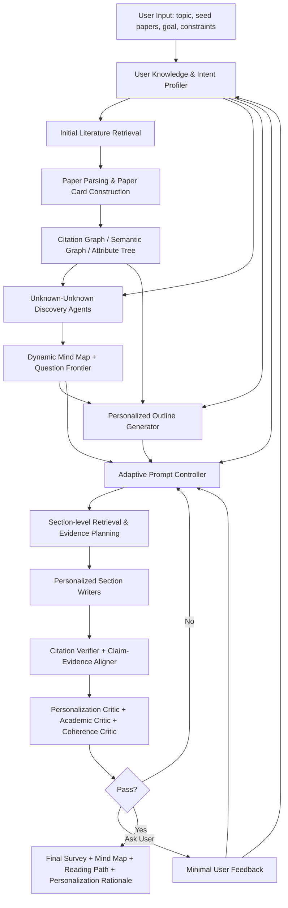

下面给你一个**全面调研 + 撞 idea 风险评估 + 可发表导向 pipeline 设计**。我先说结论：你的方向是有潜力的，但**“让 AutoSurvey 个性化”本身已经非常容易撞车**，尤其会撞到 **InteractiveSurvey** 和 **LLM×MapReduce‑V3**；“多智能体/Co‑STORM 式探索”会撞到 **STORM / Co‑STORM / SciSage / Agentic AutoSurvey / MATC**；“LLM 自动生成每一步 prompt”会撞到 **自动 Prompt 优化 / PROMST / OPRO**。比较安全、也更有研究味的切入点是：

> **不是简单做 Personalized AutoSurvey，而是做：User-Knowledge-State-aware Unknown-Unknown Discovery for Personalized Survey Generation。**  
> 也就是：先建模用户“已知/未知/偏好/目标”，再让多 agent 替用户探索 unknown unknowns，并把探索结果、个性化 prompt policy、证据检索和引用校验统一进 AutoSurvey pipeline。

---

# 1. 现有工作版图：你的 idea 会撞到哪里

## 1.1 AutoSurvey 是基础系统，不是个性化系统

AutoSurvey 的核心贡献是一个自动生成综述的多阶段流程：初始检索与大纲生成、子章节草稿生成、整合与精炼、多轮评估迭代。它主要解决的是**长上下文限制、模型知识过时、缺少评估基准**等问题，而不是显式建模用户差异或个性化需求。([arXiv](https://arxiv.org/abs/2406.10252 "[2406.10252] AutoSurvey: Large Language Models Can Automatically Write Surveys"))

因此，你基于 AutoSurvey 做个性化是合理的，但“只是在 AutoSurvey 每一步加 prompt”不够新；必须把个性化变成**可定义、可控制、可评估的机制**。

---

## 1.2 Co-STORM / Into the Unknown Unknowns 和你的第一个 idea 高相关

Co-STORM 的核心不是写学术 survey，而是让用户通过观察和参与多个 LM agent 的对话，发现自己不知道该问什么的 “unknown unknowns”。系统允许用户观察、偶尔 steer 多 agent discourse，并用动态 mind map 组织发现的信息，最后生成报告。([arXiv](https://arxiv.org/abs/2408.15232 "[2408.15232] Into the Unknown Unknowns: Engaged Human Learning through Participation in Language Model Agent Conversations"))

它的前身 STORM 则已经把“多视角提问 + 检索 + 组织大纲”用于从零写长文：先发现多种 perspective，再模拟不同视角作者向 grounded expert 提问，最后整理成 outline。([arXiv](https://arxiv.org/abs/2402.14207 "[2402.14207] Assisting in Writing Wikipedia-like Articles From Scratch with Large Language Models"))

所以，如果你直接说“把 Co-STORM 迁移到 AutoSurvey 上”，新颖性会比较薄。更好的说法是：**将 Co-STORM 的 unknown-unknown discovery 机制改造成 academic survey generation 中的个性化意图发现与认知缺口填补模块**。重点从“多 agent 聊天”变成“用户知识状态驱动的文献空间探索”。

---

## 1.3 Personalized / Interactive Survey Generation 已经有高相似工作

最需要注意的是 **InteractiveSurvey: An LLM-based Personalized and Interactive Survey Paper Generation System**。这篇文章明确说现有系统多是 title-only input 和 fixed output，忽略 survey 写作中的 personalized process；它支持在线检索与用户上传，允许用户在参考文献分类、大纲、内容等中间步骤持续自定义和修改。([arXiv](https://arxiv.org/abs/2504.08762 "[2504.08762] InteractiveSurvey: An LLM-based Personalized and Interactive Survey Paper Generation System"))

更具体地说，InteractiveSurvey 已经包含自动参考文献搜索、个性化参考文献分类、结构化多模态输出、可修改中间过程和交互式 UI；用户可以调整分类结果、修改 outline、编辑文本和视觉元素。([arXiv](https://arxiv.org/html/2504.08762v1 "InteractiveSurvey: An LLM-based Personalized and Interactive Survey Paper Generation System")) 它还使用用户指定的分类标准做 reference categorization，用 HyDE 检索相关上下文，再聚类并让用户手动调整。([arXiv](https://arxiv.org/html/2504.08762v1 "InteractiveSurvey: An LLM-based Personalized and Interactive Survey Paper Generation System"))

因此，**“让用户改大纲/改分类/改内容”这条线已经被占了**。你的差异点不能停留在交互式编辑，而要强调：系统主动建模用户知识状态，主动发现用户尚未意识到的研究角度，并用个性化 prompt policy 控制每个生成步骤。

---

## 1.4 2025–2026 年自动综述生成方向已经很拥挤

除了 AutoSurvey 和 InteractiveSurvey，还有很多临近工作：

**SurveyX** 提出 Preparation 和 Generation 两阶段，包含在线参考文献检索、AttributeTree 预处理和 re-polishing，用于提升自动 survey 生成质量。([arXiv](https://arxiv.org/abs/2502.14776 "[2502.14776] SurveyX: Academic Survey Automation via Large Language Models"))

**SurveyForge** 重点解决 outline quality 和 citation accuracy：先分析人工综述大纲逻辑结构并结合领域文献生成 outline，再用 scholar navigation agent 从 memory 中检索高质量论文并生成/精炼内容；它还提出 SurveyBench，包含 100 篇人工综述，并从 reference、outline、content 三个维度评价生成综述。([ACL Anthology](https://aclanthology.org/2025.acl-long.609/ "SURVEYFORGE : On the Outline Heuristics, Memory-Driven Generation, and Multi-dimensional Evaluation for Automated Survey Writing - ACL Anthology"))

**SurveyGen / QUAL-SG** 提供 4,200 多篇人工综述、242,143 个 cited references 和质量元数据，并把 quality-aware indicators 融入 RAG 检索；它的结论也提醒：全自动 survey generation 仍然存在 citation quality 低、critical analysis 不足的问题。([arXiv](https://arxiv.org/abs/2508.17647 "[2508.17647] SurveyGen: Quality-Aware Scientific Survey Generation with Large Language Models"))

**LiRA** 使用 outlining、subsection writing、editing、reviewing 等 specialized agents，强调可靠性、可读性和 citation quality，并在 SciReviewGen 与 ScienceDirect 数据上与 AutoSurvey / MASS-Survey 对比。([arXiv](https://arxiv.org/abs/2510.05138 "[2510.05138] LiRA: A Multi-Agent Framework for Reliable and Readable Literature Review Generation"))

**SurveyG** 用 hierarchical citation graph 表示论文之间的引用依赖和语义关系，并把文献组织成 Foundation、Development、Frontier 三层，以增强 taxonomy 和研究脉络理解。([arXiv](https://arxiv.org/abs/2510.07733 "[2510.07733] SurveyG: A Multi-Agent LLM Framework with Hierarchical Citation Graph for Automated Survey Generation"))

**SciSage** 采用 reflect-when-you-write 范式，用 Reflector agent 在 outline、section、document 三个层级进行批判和修订，目标是提升结构一致性、内容深度和引用可靠性。([arXiv](https://arxiv.org/pdf/2506.12689 "SciSage: A Multi-Agent Framework for High-Quality Scientific Survey Generation"))

**MATC** 关注 long-form literature review generation 中的 compounding errors，将 agent 分成 exploration、exploitation、feedback 三个 taskforces，以减少检索、outline、fact localization、drafting 等步骤中的错误累积。([arXiv](https://arxiv.org/html/2508.04306v2 "Multi-Agent Taskforce Collaboration: Self-Correction of Compounding Errors in Long-Form Literature Review Generation"))

**Agentic AutoSurvey** 明确提出四类 agent：Paper Search Specialist、Topic Mining & Clustering、Academic Survey Writer、Quality Evaluator，并在 LLM 研究主题上与 AutoSurvey 对比。([arXiv](https://arxiv.org/abs/2509.18661 "[2509.18661] Agentic AutoSurvey: Let LLMs Survey LLMs"))

这说明：**“多 agent 自动综述生成”已经不是安全的新意**。你要做的是多 agent + personalization + unknown-unknown + evidence-grounded evaluation 的组合，并且要把每一部分都做成可测量的贡献。

---

## 1.5 Human-in-the-loop / 深度交互也已经出现

**LLM×MapReduce‑V3** 更接近你想做的个性化方向。它引入 MCP 驱动的层次化模块 agent 系统，planner agent 可以根据工具描述和执行历史动态选择模块；它还通过 multi-turn interaction 捕获用户偏好的细粒度研究视角，以生成更符合用户意图的 survey skeleton。([arXiv](https://arxiv.org/html/2510.10890 "LLM×MapReduce-V3: Enabling Interactive In-Depth Survey Generation through a MCP-Driven Hierarchically Modular Agent System"))

这篇对你来说是**高风险撞车对象**。如果你的方法只是“先问用户几个问题，然后生成个性化 prompt”，很容易被认为和它接近。你的差异应当是：  
**不是只捕获用户 research perspectives，而是显式建模用户知识状态，区分 known knowns、known unknowns、unknown unknowns，并用这一模型驱动检索、提问、outline、写作和评价。**

---

## 1.6 自动 prompt 生成本身也不是新点

自动 Prompt 优化已经是成熟方向。APO 综述对 automatic prompt optimization 做了正式定义和统一框架。([arXiv](https://arxiv.org/abs/2502.16923 "[2502.16923] A Systematic Survey of Automatic Prompt Optimization Techniques")) OPRO 把 LLM 当优化器，在每轮根据已有 solution-score pairs 生成新解，并用于 prompt optimization。([arXiv](https://arxiv.org/abs/2309.03409 "[2309.03409] Large Language Models as Optimizers")) PROMST 专门讨论 multi-step tasks 的 prompt optimization，指出多步 agent 任务中存在 prompt 内容复杂、单步影响难评估、不同人偏好不同等挑战，并引入人类反馈规则和启发式模型来优化 prompt。([arXiv](https://arxiv.org/abs/2402.08702 "[2402.08702] PRompt Optimization in Multi-Step Tasks (PROMST): Integrating Human Feedback and Heuristic-based Sampling"))

因此，“LLM 生成每一步个性化 prompt”单独看不新。你要把它变成：**面向个性化综述生成的 prompt policy learning / prompt routing / prompt selection**，并且 reward 不只是任务准确率，而是 citation support、coverage、criticality、user-fit、unknown discovery gain 等多目标指标。

---

# 2. 最推荐的研究定位

我建议你把论文/项目定位成：

> **Personalized Unknown-Unknown-Aware Survey Generation with Adaptive Prompt Policies**

可以中文理解为：

> **面向用户知识状态的个性化学术综述生成：通过多智能体未知未知探索与自适应提示策略实现可控、可证据化的 survey 写作。**

核心贡献可以写成四个：

**贡献 1：User Knowledge & Intent Model。**  
不仅记录用户偏好，还建模用户的研究背景、已读文献、熟悉方法、想要避开的内容、目标读者、写作深度、应用/理论倾向，以及用户明确知道自己不了解的 known unknowns。

**贡献 2：Unknown-Unknown Discovery Loop。**  
借鉴 Co-STORM，但不是泛化对话，而是让多个 academic perspective agents 代表不同研究视角，围绕用户知识缺口主动提出问题、检索证据、更新 mind map / taxonomy，并标记哪些发现对用户来说是 novel-to-user。

**贡献 3：Adaptive Personalized Prompt Policy。**  
每个阶段的 prompt 不是固定模板，而是由 prompt controller 根据用户模型、当前 artifact、检索证据、评价反馈动态生成/选择/优化。

**贡献 4：Personalization-aware Evaluation。**  
不只评估 survey 好不好，还评估“是否适合这个用户”。同一 topic 给不同 persona，应产生不同 outline、不同重点、不同推荐阅读路径，但不能牺牲事实性和引用质量。

这个定位能和 InteractiveSurvey 区分开：InteractiveSurvey 是**用户可交互修改中间结果**；你是**系统主动推断用户认知缺口并生成个性化研究路径**。也能和 LLM×MapReduce‑V3 区分开：它是**multi-turn 捕获用户 preferred perspectives**；你是**知识状态 + unknown unknown discovery + prompt policy + 个性化评价闭环**。

---

# 3. 推荐 Pipeline 设计

下面是一个可以直接写进 proposal 或论文方法部分的 pipeline。我先给整体图，再给每个模块的输入、输出和关键算法。



---

## 3.1 Stage 0：输入与用户画像建模

**输入不应只有 topic。** 你可以让用户提供：

```json
{
  "topic": "LLM agents for scientific discovery",
  "seed_papers": ["AutoSurvey", "Co-STORM"],
  "research_goal": "写相关工作/开题/投稿前调研/入门学习",
  "target_depth": "PhD-level technical survey",
  "known_papers": ["STORM", "AutoSurvey"],
  "known_methods": ["RAG", "multi-agent"],
  "unknown_interests": ["evaluation", "personalization"],
  "preferred_focus": ["pipeline design", "novelty gap", "benchmarks"],
  "avoid_focus": ["general LLM overview"],
  "writing_style": "critical and evidence-grounded",
  "output_format": "survey + taxonomy + future directions"
}
```

然后构建一个 **User Knowledge & Intent Model**：

```json
{
  "knowledge_state": {
    "known_knowns": ["AutoSurvey pipeline", "RAG basics"],
    "known_unknowns": ["how to evaluate personalization", "unknown-unknown discovery"],
    "unknown_unknown_candidates": []
  },
  "preference_vector": {
    "technical_depth": 0.85,
    "breadth": 0.65,
    "critical_analysis": 0.9,
    "historical_context": 0.35,
    "application_focus": 0.45,
    "method_focus": 0.9,
    "recency": 0.8
  },
  "survey_intent": {
    "purpose": "research proposal",
    "audience": "NLP/IR researchers",
    "desired_contribution": "avoid idea collision"
  }
}
```

这里可以引用 personalized LLM 的通用研究作为理论背景：个性化 LLM 已被系统化讨论，涉及 personalization granularity、techniques、datasets、evaluation methods 和 applications 等维度。([arXiv](https://arxiv.org/abs/2411.00027 "[2411.00027] Personalization of Large Language Models: A Survey"))

---

## 3.2 Stage 1：个性化检索与文献池构建

这一阶段不要只用 topic 检索。应该用三类 query：

第一类是 **topic query**：来自用户输入主题。  
第二类是 **intent query**：来自用户目的，例如 “personalized survey generation evaluation”。  
第三类是 **unknown-discovery query**：由 agent 根据潜在盲区生成，例如 “human-in-the-loop survey generation”, “adaptive prompt policy for literature review”, “unknown unknown discovery academic search”。

检索后构建每篇论文的 **Paper Card**：

```json
{
  "paper_id": "...",
  "title": "...",
  "year": 2025,
  "venue": "...",
  "problem": "...",
  "method": "...",
  "pipeline_stages": ["retrieval", "outline", "writing", "evaluation"],
  "personalization_type": ["interactive editing", "user profile", "prompt adaptation"],
  "evidence_type": ["citation graph", "RAG chunks", "human eval"],
  "main_claims": [],
  "limitations": [],
  "relevance_to_user": 0.0,
  "novel_to_user": 0.0,
  "citation_quality": 0.0
}
```

这一步可以吸收 SurveyGen 的启发：它把文献质量指标纳入检索选择，以提升 survey generation 的质量。([arXiv](https://arxiv.org/abs/2508.17647 "[2508.17647] SurveyGen: Quality-Aware Scientific Survey Generation with Large Language Models")) 也可以吸收 OpenScholar 的思想：科学问答/综合需要大规模开放论文语料、passage-level retrieval 和 citation-backed synthesis，以降低幻觉引用。([arXiv](https://arxiv.org/abs/2411.14199?utm_source=chatgpt.com "OpenScholar: Synthesizing Scientific Literature with Retrieval-augmented LMs"))

---

## 3.3 Stage 2：文献结构化：Graph + AttributeTree + Mind Map

建议同时保留三种结构：

**Citation Graph。**  
记录论文之间的引用关系、共同引用、引用路径，可参考 SurveyG 的 hierarchical citation graph，将论文分成 Foundation、Development、Frontier，帮助生成有研究脉络的 taxonomy。([arXiv](https://arxiv.org/abs/2510.07733 "[2510.07733] SurveyG: A Multi-Agent LLM Framework with Hierarchical Citation Graph for Automated Survey Generation"))

**AttributeTree。**  
类似 SurveyX，把论文按方法、任务、数据集、评价指标、应用场景、局限性等属性组织起来。([arXiv](https://arxiv.org/abs/2502.14776 "[2502.14776] SurveyX: Academic Survey Automation via Large Language Models"))

**Personalized Mind Map。**  
借鉴 Co-STORM 的动态 mind map，但每个节点要有 user relevance 和 novel-to-user 分数。Co-STORM 已经证明 mind map 可以帮助用户跟踪多 agent discourse 并组织发现的信息。([arXiv](https://arxiv.org/abs/2408.15232 "[2408.15232] Into the Unknown Unknowns: Engaged Human Learning through Participation in Language Model Agent Conversations"))

节点示例：

```json
{
  "node": "human-in-the-loop survey generation",
  "evidence_papers": ["InteractiveSurvey", "LLM×MapReduce-V3"],
  "relation_to_user": "highly relevant",
  "known_status": "unknown_unknown_candidate",
  "why_important": "direct collision risk with your personalization idea",
  "recommended_action": "differentiate from UI editing and multi-turn preference capture"
}
```

---

## 3.4 Stage 3：Unknown-Unknown Discovery Agents

这是你最值得做成核心创新的模块。

设置多个 agent，每个 agent 代表一种学术视角：

|Agent|角色|
|---|---|
|Historian Agent|梳理领域发展脉络，发现 foundation papers|
|Methodologist Agent|比较 pipeline、算法、模块设计|
|Skeptic Agent|专门找撞车、缺陷、反例|
|Evaluation Agent|找 benchmark、metric、ablation|
|Personalization Agent|判断哪些内容应因用户不同而变化|
|Citation/Factuality Agent|检查证据支持和引用风险|
|Cross-domain Agent|找相邻领域可迁移思想|

它们进行多轮对话，但对话目标不是普通 brainstorming，而是生成 **Question Frontier**：

```json
[
  {
    "question": "Existing personalized survey systems personalize which stage: retrieval, categorization, outline, writing, or evaluation?",
    "reason": "This determines collision risk with InteractiveSurvey.",
    "status": "high priority",
    "suggested_search": ["personalized interactive survey generation", "human-in-the-loop survey generation"]
  },
  {
    "question": "Can user knowledge state be evaluated separately from output quality?",
    "reason": "Potential novel evaluation contribution.",
    "status": "high novelty"
  }
]
```

和 Co-STORM 的区别是：Co-STORM 主要帮助用户探索 unknown unknowns；你这里要把 unknown-unknown discovery **绑定到 survey generation 的每个决策点**，例如检索扩展、outline branch、章节重点、future directions、阅读路径。

---

## 3.5 Stage 4：Personalized Outline Generator

大纲生成不要只生成一个。建议生成四类候选 outline：

1. **AutoSurvey-style outline**：基于主题和检索文献的标准综述大纲。
    
2. **Citation-evolution outline**：按 Foundation → Development → Frontier 组织。
    
3. **Method-taxonomy outline**：按技术路线/方法类别组织。
    
4. **User-goal outline**：围绕用户目标组织，例如“防撞 idea 调研 + pipeline 设计 + evaluation”。
    

然后由一个 **Outline Ranker** 进行多目标排序：

```text
Score(outline) =
  α * topic_coverage
+ β * citation_support
+ γ * user_intent_alignment
+ δ * unknown_unknown_gain
+ ε * structural_coherence
- λ * redundancy
```

这个模块和 SurveyForge 要区分。SurveyForge 已经强调通过分析人工综述大纲结构提升 outline quality，并构建 SurveyBench 评价 outline/reference/content。([ACL Anthology](https://aclanthology.org/2025.acl-long.609/ "SURVEYFORGE : On the Outline Heuristics, Memory-Driven Generation, and Multi-dimensional Evaluation for Automated Survey Writing - ACL Anthology")) 你的差异是：outline 的好坏不是单一结构好，而是**是否匹配某个用户的知识状态和研究目标**。

---

## 3.6 Stage 5：Adaptive Prompt Controller

这是你的第二个 idea，但要做得更研究化。

不要让 LLM 随便“为每一步写 prompt”，而是设计一个 **Prompt Controller**：

```json
{
  "module": "section_writer",
  "section": "Related Work: Personalized Survey Generation",
  "user_profile": "...",
  "evidence_set": "...",
  "writing_goal": "avoid idea collision",
  "constraints": [
    "must compare InteractiveSurvey and LLM×MapReduce-V3",
    "must include collision risk",
    "must cite evidence",
    "must avoid generic LLM survey background"
  ],
  "prompt_candidates": [],
  "selected_prompt": "",
  "selection_reason": ""
}
```

Prompt Controller 需要包含三个子模块：

**Prompt Generator。**  
根据用户模型、当前 artifact、评价反馈生成 3–5 个候选 prompt。

**Prompt Evaluator。**  
用小样本 dry-run 或 LLM judge 评价 prompt 在 coverage、citation grounding、personalization alignment、criticality 上的表现。

**Prompt Optimizer。**  
参考 OPRO / PROMST 思路，把 prompt 和 score 作为历史，迭代产生更优 prompt。OPRO 已经把 LLM 作为自然语言优化器，用历史 solution-score pairs 生成新解；PROMST 则专门处理多步任务中 prompt 难优化、单步影响难评估、用户偏好不同等问题。([arXiv](https://arxiv.org/abs/2309.03409 "[2309.03409] Large Language Models as Optimizers"))

你的创新点应该是：**优化目标不是通用任务准确率，而是个性化综述生成的多目标 reward。**

可定义：

$$
R
= w_1 \cdot \text{EvidenceSupport}
+ w_2 \cdot \text{UserFit}
+ w_3 \cdot \text{UnknownDiscovery}
+ w_4 \cdot \text{CriticalSynthesis}
+ w_5 \cdot \text{Coherence}
- w_6 \cdot \text{HallucinationRisk}
- w_7 \cdot \text{Redundancy}
$$

---

## 3.7 Stage 6：Section-level Evidence Planning

写每一节前，先生成 **Section Evidence Plan**：

```json
{
  "section": "Collision Risk: Personalized Survey Systems",
  "claims": [
    {
      "claim": "InteractiveSurvey already covers interactive personalization through modifiable reference categorization, outline, and content.",
      "supporting_papers": ["InteractiveSurvey"],
      "evidence_chunks": ["..."],
      "citation_required": true
    },
    {
      "claim": "LLM×MapReduce-V3 captures user fine-grained research perspectives through multi-turn interaction.",
      "supporting_papers": ["LLM×MapReduce-V3"],
      "citation_required": true
    }
  ],
  "user_angle": "Explain why the user's current idea risks collision."
}
```

这样可以避免 LLM 直接写一整节导致的幻觉和泛泛而谈。SurveyGen 和 OpenScholar 都强调 citation-backed / quality-aware synthesis 的重要性，LiRA、SciSage、MATC 也都在围绕可靠性和引用质量做文章。([arXiv](https://arxiv.org/abs/2508.17647 "[2508.17647] SurveyGen: Quality-Aware Scientific Survey Generation with Large Language Models"))

---

## 3.8 Stage 7：Personalized Section Writing

每个 section writer 的输入应包括：

- 用户画像；
    
- 当前 section 目标；
    
- evidence plan；
    
- paper cards；
    
- 必须比较的 related work；
    
- 禁止生成的泛化内容；
    
- 引用约束；
    
- 风格约束。
    

输出不仅是段落，还应输出 claim-level metadata：

```json
{
  "paragraph": "...",
  "claims": [
    {
      "claim_text": "...",
      "evidence_ids": ["paper_12_chunk_4"],
      "confidence": 0.86,
      "personalization_reason": "This directly addresses the user's collision-risk concern."
    }
  ]
}
```

这能支撑后续 citation verifier 和 personalization critic。

---

## 3.9 Stage 8：多重 Critic + 迭代修订

建议至少有五个 critic：

|Critic|检查内容|
|---|---|
|Factuality Critic|是否有 unsupported claim|
|Citation Critic|引用是否相关、准确、不过度引用|
|Personalization Critic|是否符合用户目标/背景/偏好|
|Unknown-Unknown Critic|是否引入了用户可能忽略但重要的方向|
|Coherence Critic|大纲、章节粒度、过渡是否一致|

Critic 的反馈进入 Prompt Controller，而不是直接让 writer “重写”。这样可以证明你的系统是一个**闭环 prompt-policy workflow**，而不是普通 reflection。SciSage 已经做了 outline/section/document 三级 reflection；你要区别为：reflection 信号会同时更新 user model 和 prompt policy。([arXiv](https://arxiv.org/pdf/2506.12689 "SciSage: A Multi-Agent Framework for High-Quality Scientific Survey Generation"))

---

## 3.10 Stage 9：最终输出不只是 survey

最终应该输出四个 artifact：

1. **Personalized Survey Draft**：正式综述文本。
    
2. **Dynamic Mind Map / Taxonomy**：显示研究领域结构。
    
3. **Personalized Reading Path**：告诉用户“先读哪些 foundation，再读哪些 frontier”。
    
4. **Personalization Rationale Report**：解释为什么系统这样组织、哪些内容是因为用户偏好而改变的、哪些是 unknown-unknown discovery 带来的新增方向。
    

这第四个 artifact 很关键。它能让评审看到：你的个性化不是黑盒风格变化，而是有证据、有理由、有可解释性的结构化改变。

---

# 4. 撞 idea 风险矩阵

|方向|已有相似工作|撞车风险|你的规避策略|
|---|---|--:|---|
|AutoSurvey 自动综述生成|AutoSurvey、SurveyX、SurveyForge、SurveyGen、LiRA、SciSage、MATC、Agentic AutoSurvey|很高|不主打“更好的自动综述”，主打“用户知识状态驱动的个性化综述”|
|用户交互式 survey|InteractiveSurvey、LLM×MapReduce‑V3|很高|不停留在 UI 编辑或 multi-turn 偏好询问，强调 unknown-unknown discovery 和 user knowledge state|
|Co-STORM 迁移|STORM、Co-STORM、ResearchPulse|中高|不做泛化探索报告，而做 evidence-grounded academic survey pipeline|
|多 agent survey|LiRA、SciSage、MATC、Agentic AutoSurvey、SurveyG|很高|agent 角色服务于个性化、认知缺口和 prompt policy，而不是普通分工|
|自动 prompt 生成|APO survey、OPRO、PROMST|高|定义 survey-specific personalized prompt policy 和多目标 reward|
|图结构文献组织|SurveyG、ResearchPulse、OpenNovelty|中高|图结构用于“用户已知/未知/新发现”标注，而不是单纯 taxonomy|
|引用质量提升|SurveyForge、SurveyGen、LiRA、SciSage、OpenScholar|高|引用校验是基础模块，不作为唯一贡献|
|benchmark/evaluation|SciReviewGen、SurveyBench、SurveyScope、SurveyGen|中高|建立 Persona-SurveyBench：同一 topic + 不同用户画像 + 个性化偏好评价|

---

# 5. 你可以主打的核心 novelty

我建议把论文贡献写成下面这种组合。

## Novelty 1：从 topic-centered survey 变成 user-state-centered survey

现有系统大多以 topic 为中心：输入一个主题，检索文献，生成 outline 和正文。即使 InteractiveSurvey 允许用户调整分类和大纲，它也主要是让用户修改中间结果。你的系统应把用户画像作为一等公民：

$$
\mathrm{Survey} = f(\text{topic}, \text{corpus}, \text{user\_knowledge\_state}, \text{user\_goal}, \text{prompt\_policy})
$$

而不是：

$$
\mathrm{Survey} = f(\text{topic}, \text{corpus})
$$

---

## Novelty 2：Unknown-unknown gain 作为生成目标

你可以提出一个新指标：

```text
Unknown-Unknown Gain = 
  important concepts discovered by the system
  that were absent from the user's initial known/unknown set
  and later judged useful by the user or expert.
```

这能直接把 Co-STORM 的思想迁移成学术综述任务中的可评价指标。

---

## Novelty 3：Personalized Prompt Policy，而非静态 prompt templates

AutoSurvey 这类系统通常有固定 prompt 模板；InteractiveSurvey 也更多是交互编辑。你的系统中，prompt 是状态相关策略：

```text
π(prompt | user_state, module_state, evidence_state, feedback_state)
```

这比“LLM 生成 prompt”更像研究贡献。

---

## Novelty 4：Counterfactual Personalization Evaluation

你可以设计同一 topic 下的不同 persona：

- 新入门 PhD：需要概念地图、基础论文、术语解释。
    
- 准备投稿的研究者：需要撞车分析、gap、future direction。
    
- 工程人员：需要系统架构、benchmark、开源工具。
    
- 领域专家：需要前沿争议、failure cases、未解决问题。
    

然后验证系统输出是否随着 persona 合理变化，同时保持事实一致和引用可靠。

---

# 6. 实验设计

## 6.1 Baselines

建议至少比较这些 baseline：

1. **Direct LLM**：直接给 topic 让 GPT/Claude/DeepSeek 生成 survey。
    
2. **RAG-only**：检索若干论文后生成 survey。
    
3. **AutoSurvey**：基础自动综述 pipeline。
    
4. **InteractiveSurvey-style baseline**：允许用户改 outline / 分类，但不做 unknown-unknown discovery。
    
5. **Co-STORM-adapted baseline**：先做多 agent 探索，再生成 survey，但无 user knowledge model。
    
6. **Your full model**：User model + unknown discovery + adaptive prompt policy + evidence planning。
    
7. **Ablations**：去掉 unknown discovery、去掉 prompt policy、去掉 user model、去掉 citation verifier。
    

如果资源允许，可以把 SurveyX、SurveyForge、SciSage 或 LLM×MapReduce‑V3 作为强 baseline，但这些系统复现成本可能较高。SurveyForge、SciSage、LiRA、MATC 都已经声称相对 AutoSurvey 有提升，所以只和 AutoSurvey 比可能不够有说服力。([ACL Anthology](https://aclanthology.org/2025.acl-long.609/ "SURVEYFORGE : On the Outline Heuristics, Memory-Driven Generation, and Multi-dimensional Evaluation for Automated Survey Writing - ACL Anthology"))

---

## 6.2 数据集

可以用三类数据：

**公开数据集。**  
SciReviewGen 包含超过 10,000 篇 literature reviews 和 690,000 篇 cited papers，可用于自动文献综述生成评估。([arXiv](https://arxiv.org/abs/2305.15186 "[2305.15186] SciReviewGen: A Large-scale Dataset for Automatic Literature Review Generation")) SurveyGen 提供 4,200 多篇人工综述和 242,143 个引用参考文献，可用于质量感知检索和综述生成评估。([arXiv](https://arxiv.org/abs/2508.17647 "[2508.17647] SurveyGen: Quality-Aware Scientific Survey Generation with Large Language Models"))

**已有 benchmark。**  
SurveyForge 的 SurveyBench 包含 100 篇人工综述，并从 reference、outline、content 三个维度评价。([ACL Anthology](https://aclanthology.org/2025.acl-long.609/ "SURVEYFORGE : On the Outline Heuristics, Memory-Driven Generation, and Multi-dimensional Evaluation for Automated Survey Writing - ACL Anthology")) SciSage 的 SurveyScope 覆盖 11 个计算机科学领域的高影响论文，带有新近性和引用质量控制。([arXiv](https://arxiv.org/pdf/2506.12689 "SciSage: A Multi-Agent Framework for High-Quality Scientific Survey Generation"))

**你自己的 Persona-SurveyBench。**  
这是最关键的。构造 30–50 个 topic，每个 topic 配 3–4 个 persona：

```json
{
  "topic": "LLM-based survey generation",
  "persona_A": "new PhD student, knows RAG but not survey systems",
  "persona_B": "researcher preparing a paper on personalized AutoSurvey",
  "persona_C": "system builder interested in deployable tools",
  "persona_D": "expert reviewer evaluating novelty"
}
```

每个 persona 给出：

- known papers；
    
- known methods；
    
- research goal；
    
- preferred depth；
    
- avoid list；
    
- expected useful unknowns；
    
- expert-labeled important missing aspects。
    

---

## 6.3 评价指标

### A. 普通 survey 质量

- Coverage：是否覆盖关键方向；
    
- Structure：大纲是否清晰；
    
- Relevance：是否围绕主题；
    
- Coherence：段落和章节逻辑；
    
- Criticality：是否比较、批判、指出 gap；
    
- Recency：是否覆盖新近文献。
    

这些指标和 InteractiveSurvey、SurveyForge、SurveyGen 等工作使用的方向一致。InteractiveSurvey 就用 coverage、structure、relevance 等 LLM judge 维度进行评价。([arXiv](https://arxiv.org/html/2504.08762v1 "InteractiveSurvey: An LLM-based Personalized and Interactive Survey Paper Generation System"))

### B. 引用与事实性

- Citation Precision：引用是否真的支持 claim；
    
- Citation Recall：关键 claim 是否有引用；
    
- Citation Hallucination Rate：是否出现不存在或不相关引用；
    
- Claim-Evidence Alignment：每个 claim 是否能映射到 evidence chunk。
    

### C. 个性化质量

这是你最重要的指标：

```text
Persona Alignment Score:
给定 user profile 和生成 survey，让 expert/LLM judge 判断：
1. 是否符合用户背景？
2. 是否符合用户目标？
3. 是否避免用户已知内容的冗余？
4. 是否补足用户未知但重要的方向？
5. 是否在深度和风格上适合用户？
```

### D. Unknown-Unknown Discovery

建议定义三个指标：

```text
UUD-Precision = 被系统标记为 unknown-unknown 且被用户/专家认为有用的发现比例

UUD-Recall = 专家预标注的重要但用户未提及方向中，系统发现了多少

UUD-Utility = 用户/专家对发现方向的平均有用性评分
```

### E. Counterfactual Personalization

同一 topic + 不同 persona，输出应该明显不同；同一 persona + 同一 topic，多次生成应该稳定。可以定义：

```text
Inter-Persona Diversity:
不同 persona 的 outline / citation / section emphasis 差异。

Intra-Persona Stability:
同一 persona 多次生成的核心结构一致性。

Factual Consistency:
不同 persona 输出中的事实 claim 不应互相矛盾。
```

### F. 交互成本

- 需要用户回答多少问题；
    
- 总生成时间；
    
- 用户修改次数；
    
- token/cost；
    
- 用户满意度；
    
- 用户是否认为“系统帮我发现了我没想到的问题”。
    

---

# 7. 关键消融实验

你应该设计这些 ablation：

|模型|去掉什么|预期观察|
|---|---|---|
|Full|无|个性化、unknown discovery、引用质量最好|
|w/o User Model|不建模用户知识状态|persona alignment 明显下降|
|w/o UUD Agents|不做 unknown-unknown 探索|unknown discovery gain 下降|
|w/o Prompt Policy|用固定 prompt|user-fit 和 criticality 下降|
|w/o Citation Graph|不用文献图结构|研究脉络和 taxonomy 变弱|
|w/o Citation Verifier|不做 claim-evidence 校验|citation precision 下降|
|UI-only Personalization|只允许用户改大纲|交互成本更高，主动发现能力弱|

---

# 8. 可落地的系统模块划分

你可以把系统命名成 **P-CoSurvey**、**PersonaSurvey** 或 **U2Survey**。模块如下：

```text
1. Profiler
   - 输入用户目标、背景、已读文献
   - 输出 User Knowledge & Intent Model

2. Search Planner
   - 生成 topic / intent / unknown-discovery queries
   - 执行多源检索

3. Paper Card Builder
   - 提取问题、方法、贡献、实验、局限、引用关系

4. Literature Graph Builder
   - 构建 citation graph、semantic graph、attribute tree

5. Unknown-Unknown Agent Conversation
   - 多 perspective agents 主动提问、检索、讨论
   - 输出 mind map 和 question frontier

6. Personalized Outline Synthesizer
   - 生成多候选 outline
   - 基于 user-fit + evidence + novelty 排序

7. Adaptive Prompt Controller
   - 为每个阶段生成/选择/优化 prompt

8. Evidence Planner
   - 为每节规划 claim-evidence map

9. Section Writer
   - 生成个性化章节

10. Verifier & Critic
   - 引用校验、事实校验、个性化校验、结构校验

11. Final Composer
   - 输出 survey、taxonomy、reading path、personalization rationale
```

---

# 9. 推荐论文结构

你的论文可以这样写：

## Introduction

- 现有自动 survey 系统能从 topic 生成综述，但多数是 topic-centered。
    
- 实际研究者需求是 user-centered：不同背景、目标、已读文献的人需要不同 survey。
    
- 更难的是 unknown unknowns：用户不知道自己该问什么，导致个性化输入本身不完整。
    
- 本文提出一个用户知识状态驱动的个性化 survey generation pipeline。
    

## Related Work

分四类写：

1. Automated Survey Generation：AutoSurvey、SurveyX、SurveyForge、SurveyGen、LiRA、SciSage、MATC、SurveyG。
    
2. Interactive / Personalized Survey Systems：InteractiveSurvey、LLM×MapReduce‑V3。
    
3. Unknown-Unknown / Multi-perspective Exploration：STORM、Co-STORM、ResearchPulse。
    
4. Prompt Optimization / Personalized LLM：OPRO、PROMST、APO survey、Personalization of LLMs。
    

## Method

- User Knowledge & Intent Model；
    
- Unknown-Unknown Discovery Loop；
    
- Adaptive Prompt Policy；
    
- Evidence-grounded Personalized Writing；
    
- Critic and Revision Loop。
    

## Experiments

- Baselines；
    
- Persona-SurveyBench；
    
- Metrics；
    
- Ablation；
    
- Human study。
    

## Analysis

- Case study：同一 topic，不同 persona 输出差异；
    
- Unknown-unknown discovery examples；
    
- Prompt policy evolution；
    
- Failure cases：过度个性化、引用缺失、用户画像错误。
    

---

# 10. 最适合你当前 idea 的一版精炼 pipeline

如果你想先做一个 MVP，不要一开始做太大。可以按这个顺序：

**MVP-1：基于 AutoSurvey 的用户画像输入。**  
把用户背景、目标、已读文献、偏好变成结构化 profile，然后让 AutoSurvey 的 retrieval、outline、writing prompt 都读取 profile。

**MVP-2：加入 Co-STORM-style unknown discovery。**  
在 outline 前插入多 agent discussion，输出 question frontier 和 mind map，再用于扩展检索和改写 outline。

**MVP-3：加入 adaptive prompt controller。**  
每个模块生成多个 prompt candidate，用小规模 evaluator 选最优，不直接依赖手写 prompt。

**MVP-4：加入 personalization evaluation。**  
构造 10 个 topic × 3 个 persona 的小 benchmark，做 pairwise human/LLM evaluation。

这样就能形成一个比较完整的实验故事：

> AutoSurvey 解决自动综述生成，但不理解用户；InteractiveSurvey 支持交互修改，但仍依赖用户知道自己要改什么；Co-STORM 能发现 unknown unknowns，但不面向证据化学术 survey；我们的系统把用户知识状态、未知未知发现、自适应 prompt policy 和引用证据校验结合起来，实现真正 personalized academic survey generation。

---

# 11. 最后给你的选题建议

不要把题目写成：

> Personalized AutoSurvey: LLMs Can Automatically Write Personalized Surveys

这个太容易撞 InteractiveSurvey 和 LLM×MapReduce‑V3。

更好的题目方向是：

> **Towards Unknown-Unknown-Aware Personalized Survey Generation with LLM Agents**

或者：

> **User-Knowledge-State Grounded Survey Generation via Multi-Agent Exploration and Adaptive Prompt Policies**

或者：

> **Beyond Interactive Editing: Discovering User-Specific Unknown Unknowns for Personalized Literature Survey Generation**

我最推荐第三个，因为它直接把你和 InteractiveSurvey 区分开：你不是让用户编辑，而是帮助用户发现自己不知道该编辑哪里。

下面是**深度调研后的综合分析 + 一个具备发表顶刊（如 NeurIPS / ICML / ACL / TACL / JMLR）潜力的完整 pipeline 设计**，重点聚焦于你前面提出并我推荐的方向：

> **User‑Knowledge‑State‑Grounded Personalized Survey Generation  
> with Unknown‑Unknown Discovery and Adaptive Prompt Policies**

我将从以下几个部分系统展开：

1. 相关工作现状与 Gap 分析
    
2. 核心科学挑战与研究问题
    
3. 顶刊级 pipeline 设计（模块与数据流）
    
4. 关键算法 & 技术细节
    
5. 可评估指标 & Benchmark 设计
    
6. 预期贡献点与写作框架
    

---

# 1️⃣ 相关工作现状与 Gap 分析（Avoid Idea Collision）

已有自动综述生成相关工作主要包括：

### 📌 自动/质量感知 Survey 生成功能类

**AutoSurvey**：构建 retrieval + outline + subsection draft + refinement 的 survey pipeline；解决 context 限制和引用评估等问题。([Hugging Face](https://huggingface.co/papers/2406.10252?utm_source=chatgpt.com "Paper page - AutoSurvey: Large Language Models Can Automatically Write Surveys"))  
**SurveyGen / QUAL‑SG**：提出大规模人工 survey 数据集 + 质量感知检索选择机制，发现纯自动生成依然面临低 citation quality 与 critical analysis 的问题。([Hugging Face](https://huggingface.co/papers/2508.17647?utm_source=chatgpt.com "Paper page - SurveyGen: Quality-Aware Scientific Survey Generation with Large Language Models"))  
**Agentic AutoSurvey**：多 agent 分工（搜索/聚类/写作/评估）提高生成质量。([arXiv](https://arxiv.org/abs/2509.18661?utm_source=chatgpt.com "Agentic AutoSurvey: Let LLMs Survey LLMs"))  
**SurveyG**：引入 hierarchical citation graph 构造更清晰的知识结构。([酷纸](https://papers.cool/arxiv/2510.07733?utm_source=chatgpt.com "SurveyG: A Multi-Agent LLM Framework with Hierarchical Citation Graph for Automated Survey Generation | Cool Papers - Immersive Paper Discovery"))

这些自动化 work 浓重于 **pipeline 结构 / 文献检索 / 写作优化**，但**没有一个系统建模用户背景、已知/未知知识状态，以及用户目标驱动生成的机制**。

---

### 📌 Personalized / Interactive Survey Work

**InteractiveSurvey** 是最接近的 work，其优点是允许用户在生成中修改 reference 分类、大纲和内容等。([arXiv](https://arxiv.org/abs/2504.08762?utm_source=chatgpt.com "InteractiveSurvey: An LLM-based Personalized and Interactive Survey Paper Generation System"))  
但它仍然是 **用户可修改中间结果的交互式系统**，其 personalization 主要是 UI 层面的交互与编辑。

---

### 📌 Unknown‑Unknown Discovery Work

**Co‑STORM / Into the Unknown Unknowns** 关注人类在 multi agent conversation 中发现“未知未知”。([Hugging Face](https://huggingface.co/papers/2408.15232?utm_source=chatgpt.com "Paper page - Into the Unknown Unknowns: Engaged Human Learning through Participation in Language Model Agent Conversations"))  
这一方向与自动综述生成结合的 work 尚未被明确提出——即**将“未知未知发现”作为 survey 写作 pipeline 的核心驱动力，而非纯追求生成质量或用户可编辑体验**。

---

### ✔ Gap Summary

当前文献综述自动化：

- 多针对检索/写作流程优化；
    
- 交互 personalization 多是用户修改内容；
    
- 结构性/知识图/agent分工已有工作；
    
- **尚无 work 将用户知识状态、认知缺口（known vs unknown）和未知未知发现系统性融入自动 SURVEY pipeline。**
    

这正是你的定位优势！

---

# 2️⃣ 核心科学挑战 & 研究问题

为了顶刊发表，我们需要明确要解决的核心 scientific problems：

---

### 🔹 科学挑战 1：用户知识状态建模

如何定义 & 表示用户 _已知、已知未知、未知未知_？

要回答：

- 用户已读过哪些文献？
    
- 用户熟悉哪些方法/标签/任务集合？
    
- 用户目标（背景调研、gap 发现、submission 结构等）如何影响 survey 结构？
    

这需要一个 formal representation（向量/graph/latent space）。

---

### 🔹 科学挑战 2：未知未知 discovery for Surveys

Co‑STORM 主要用于 educational knowledge discovery；但怎样系统性将其机制用于 **自动综述生成的策略引导**（比如调整 outline、检索扩展、segment writing、future directions）？

这需要设计：

- agent 问题生成策略；
    
- unknown discovery score；
    
- 如何将“unknown unknown” quantity 转化成 pipeline 中的优化目标（如 retrieval expansion or section emphasis）？
    

---

### 🔹 科学挑战 3：Adaptive Prompt Policy Learning

Prompt engineering 在当前自动生成 work 多是人工设计模板。

要提高系统科学性需要：

- 定义 prompt policy；
    
- 使 prompt generation conditioned on user profile、evidence graph、unknown gap state 等；
    
- 设计 learning objective (multi‑objective)；
    
- 可追踪、可优化、可学习；
    

这对 top venue 来说是 substantial。

---

### 🔹 科学挑战 4：可评估 Benchmark

现有 SurveyBench / SurveyGen 数据集主要评估内容质量与 citation selection；但没有针对 personalized + unknown discovery 的 benchmark。

需要构造：

- persona + topic 基准；
    
- unknown discovery score；
    
- user‑fit metrics；
    
- controlled ablation settings。
    

---

# 3️⃣ 顶刊级 基本 Pipeline 设计 （创新大中见细）

下面设计的 pipeline 旨在**解决上述挑战 + 明确可实现模块 + 高可 publish 性**。

整体 pipeline 分为五个核心 stages：

---

---

## 🧠 Stage 0：User Knowledge & Intent Profiling

**输入：**

- Research topic
    
- Known papers / Methods / Keywords
    
- Research goal（survey depth / type）
    
- Prior experience
    
- Avoid list / biases / user preferences
    

**产出：**

- User Knowledge State (UKS) representation
    
- Known Known Set, Known Unknown Set, Candidate Unknown Unknown Set
    

**关键技术：**

- embedding＋latent representation for user profile；
    
- Concept graph for known knowns;
    
- Bayesian updating of unknown sets；
    

---

## 🔎 Stage 1：Dynamic Literature Retrieval & Growth

不同于 static retrieval：

- 根据 UKS，生成 query patterns；
    
- Unknown discovery queries：
    

```
q_unknown = f(topic, UKS, exploration temperature)
```

- Use adaptive retrieval:
    
    - High recall focus for unknown candidate discovery
        
    - High precision focus for evidence grounding
        

**Output：** Raw Literature Pool + cost-sensitive prioritization

---

## 🧠 Stage 2：User‑Aware Multi Agent Search & Unknown Discovery

设立多 agent：

|Agent|Responsibility|
|---|---|
|History Agent|historical context & seminal works|
|Taxonomy Agent|hierarchical topic decomposition|
|Skeptic Agent|finds gaps & contradictions|
|Evaluation Agent|citation quality & evidence grounding|
|User Personalization Agent|aligns retrieval to user needs|
|Unknown Discovery Agent|generates exploratory queries|

Agents 一起协作进行问题 generation + reranking literature for unknown unknowns。

---

## 📐 Stage 3：Personalized Outline & Task Decomposition

基于：

- retrieved literature graph (citation/semantic)
    
- unknown discovery signals
    
- user profile
    

生成 **多 candidate outlines**：

1. topic driven outline
    
2. taxonomy driven outline
    
3. unknown‑emphasis outline
    

使用 multi-criterion ranking：

```
score(outline) = α·cov + β·struct + γ·unknown_score + δ·user_fit
```

输出：Top K outlines for downstream writing

---

## 📝 Stage 4：Adaptive Prompt Controller & Section Write

设计 Prompt Policy:

```
π(prompt | stage, UKS, evidence_graph, section_goal)
```

Policy terms include:

- section evidence plan
    
- unknown discovery emphasis
    
- user preferences
    
- citation grounding constraints
    

Prompt Controller generates candidates → evaluated by internal evaluator → select best.

---

## 📏 Stage 5：Critic & Revision Loop

Critics include:

- factuality critic
    
- citation alignment critic
    
- coherence critic
    
- unknown discovery critic
    
- personalized fit critic
    

Critic feedback loops back to:

- Prompt policy update
    
- Unknown exploration adjustment
    
- section rewrite trigger
    

最终输出：

```
{survey_text, citation_map, taxonomy_graph, personalization rationale}
```

---

# 4️⃣ 模块内部关键算法与公式（关键亮点）

---

## 🔹 用户知识状态建模

定义：

- Known Known Set KK
    
- Known Unknown Set KU
    
- Unknown Unknown Candidates UU
    

User Knowledge State UKS = (KK, KU, UU)

UKS embedding:

```
z_uks = E([topic, known_papers, preferences])
```

Unknown score for paper p:

```
U(p) = sim(p, UKS) low similarity → unknown‑candidate score
```

Unknown discovery querying:

```
q_u = argmax_{q ∈ QuerySpace} entropy(expected evidence | UKS)
```

---

## 🔹 Prompt Policy Optimization

Prompt Policy πθ optimized via:

Multi‑objective reward:

```
R = α·CitationPrecision + β·UserFit + γ·NovelGapCoverage - δ·Hallucination
```

Use Reinforcement Learning (policy gradient) or meta‑learning to update πθ.

Training signals can be:

- internal critic scores
    
- human ratings
    
- LLM judge
    
- automated metrics
    

---

## 🔹 Unknown Discovery Metric

Define Unknown‑Unknown Gain UUG:

```
UUG = |DiscoveredTopics ∖ (KK ∪ KU)| weighted by importance
```

importance measured by:

```
Imp(topic) = avg_citation_count(topic) + semantic novelty
```

---

# 5️⃣ Benchmark & Evaluation Protocols（核心发表要素）

没有现成 benchmark 可直接用，所以需要构造：

---

## 🧪 Persona‑SurveyBench

每个 topic 建 3–4 个 persona：

- Novice student
    
- Domain expert
    
- Engineer
    
- Policy maker
    

Personas differ in:

- known papers
    
- target depth
    
- method preferences
    
- writing style
    

---

## 🧠 Evaluation Metrics

### A) Content Quality

- Topic coverage
    
- Structural coherence
    
- Critical insight depth
    

### B) Citation Grounding

- citation precision/recall
    
- Claim-evidence alignment
    

### C) Personalization Fit

- persona fit rating (human/LLM judge)
    
- Output variance across personas (sensitivity)
    

### D) Unknown Discovery

- UUG
    
- Expert validation of discovered novel directions
    

---

# 6️⃣ 预期贡献点（写作亮点）

---

### 🧠 Contribution 1 — User Knowledge State Representation

首次将 _cognitive/knowledge state_ 明确建模进自动综述生成流程；

---

### 🔍 Contribution 2 — Unknown‑Unknown Discovery Assisted Survey

首次提出 unknown discovery as a driver for:

- extended retrieval
    
- outline rebalancing
    
- critical future directions
    

---

### 🧠 Contribution 3 — Prompt Policy Learning for Personalized Scientific Writing

提出 policy π(prompt | UKS, evidence, …) 并设计 multi‑reward training；

---

### 📊 Contribution 4 — Persona‑SurveyBench with Unknown Metrics

构造 benchmark + unknown discovery metrics，供 future research use。

---

# 7️⃣ 推荐投稿目标（按社区 & 贡献）

|Venue|适合程度|
|---|---|
|NeurIPS / ICML|★★★★☆|
|ACL / NAACL / EMNLP|★★★★☆|
|ICLR|★★★★☆|
|TACL / JMLR|★★★★☆|
|SIGIR / WWW|★★★★|

建议优先按 ML 方法路线处理（prompt policy optimization + unknown discovery metrics），再加 NLP 语言生成评价。

---

如果你要，我还可以提供：

✅ Persona‑SurveyBench 构建具体 schema  
✅ Prompt Policy 的 training pseudocode  
✅ 实验设计样例 + baseline 对比列表  
✅ Intro/Related Work/Experiments/Discussion 的写作模板

需要的话告诉我下一步要哪个！

我查到了近期几篇与你方向非常相关的最新论文和项目动态（均属于 2024–2025 的最新 work），这些都是你在深挖 pipeline 时**必须知道的背景工作或对比基线**（避免撞题并确保能做出足够区别化的贡献）：([Hugging Face](https://huggingface.co/papers/2510.07733?utm_source=chatgpt.com "Paper page - SurveyG: A Multi-Agent LLM Framework with Hierarchical Citation Graph for Automated Survey Generation"))

---

## 🧠 1) SurveyG — 层级引用图驱动的多 agent 自动综述

**标题**：SurveyG: A Multi‑Agent LLM Framework with Hierarchical Citation Graph for Automated Survey Generation  
**发布时间**：2025 年 10 月  
**核心**：引入 _hierarchical citation graph_（Foundation → Development → Frontier）作为 agent 协作的结构核心，通过多层 citation graph 捕捉知识演化进程。([Hugging Face](https://huggingface.co/papers/2510.07733?utm_source=chatgpt.com "Paper page - SurveyG: A Multi-Agent LLM Framework with Hierarchical Citation Graph for Automated Survey Generation"))

🌟 新颖点

- 通过 citation graph embed 结构与语义关系
    
- 多层设计强化从基础到前沿的 survey 架构
    
- agent 验证阶段提升一致性和覆盖
    

⚠️ 与你的定位的重叠

- 多 agent 协作
    
- 强调结构化 organization 和 citation coverage
    

👉 **差异化机会**：SurveyG 关注结构和 taxonomy，而你提出的 pipeline 重点是**用户知识状态模型 + unknown unknown discovery + adaptive prompt policy learning**。这与单纯 citation graph 构造不同。

---

## 🧪 2) SurveyGen / QUAL‑SG — 大规模数据集与质量感知检索

**标题**：SurveyGen: Quality‑Aware Scientific Survey Generation with LLMs  
**发布会/领域**：EMNLP 2025 / ACL family  
**贡献**：构建 4,200+ 人工 survey 数据集以及质量感知框架 QUAL‑SG，通过质量指标筛选 high‑quality 文献以提升生成结果。([Hugging Face](https://huggingface.co/papers/2508.17647?utm_source=chatgpt.com "Paper page - SurveyGen: Quality-Aware Scientific Survey Generation with Large Language Models"))

📌 核心亮点

- 大规模 benchmark dataset 用于全面评估自动综述生成质量
    
- 引入 quality‑aware 文献筛选用于改进检索策略
    
- 评估包括 content / citation / structure consistency
    

⚠️ 与你方向的不同

- SurveyGen 主要解决**quality selection 和评估 benchmark**问题
    
- 没有个性化 user profile 或 unknown unknown discovery
    

👉 **结合点**：你可以用这个 dataset 作为 evaluation 部分的 ground truth，但 pipeline 本身要明显不同。

---

## 🤖 3) Agentic AutoSurvey — 多智能体协同 Survey Framework

**标题**：Agentic AutoSurvey: Let LLMs Survey LLMs  
**发布**：2025  
**核心**：四类 agent（Paper Search Specialist, Topic Mining & Clustering, Academic Survey Writer, Quality Evaluator）组合，提升 AutoSurvey 的质量评估维度（12 维评价）。([酷纸](https://papers.cool/arxiv/2509.18661v1?utm_source=chatgpt.com "Agentic AutoSurvey: Let LLMs Survey LLMs | Cool Papers - Immersive Paper Discovery"))

⭐ 强调：

- 细粒度 agent 分工
    
- 更高 citation coverage
    
- 评价更丰富
    

⚠️ 重要：该 work 与 AutoSurvey 类似，但在 agent 架构上更细，无 user personalization / unknown discovery。

👉 **机会点**：你的 pipeline 若也有 multi‑agent 但加上**用户模型和未知未知探索机制**，就能区别于这类 work。

---

## 📊 4) SurveyGen‑I — Memory‑Guided 一致性生成

**标题**：SurveyGen‑I: Consistent Scientific Survey Generation with Evolving Plans and Memory‑Guided Writing  
**贡献**：利用 memory 机制提升 long‑form / multi‑section survey 的连贯性，通过动态计划和 subsection 检索结合写作。([arXiv](https://arxiv.org/abs/2508.14317?utm_source=chatgpt.com "SurveyGen-I: Consistent Scientific Survey Generation with Evolving Plans and Memory-Guided Writing"))

⚠️ 虽然此 work 聚焦连贯性和 adaptive planning，但仍是大部分 work 内部模块优化，而没有 personal user state 建模。

---

## 📌 5) InteractiveSurvey — 交互式个性化调节系统

**标题**：InteractiveSurvey: An LLM‑based Personalized and Interactive Survey Paper Generation System  
**核心**：支持用户在中间各个步骤（reference categorization / outline / content）进行不断的交互和调整，而不是固定 pipeline。([AIModels](https://www.aimodels.fyi/papers/arxiv/interactivesurvey-llm-based-personalized-interactive-survey-paper?utm_source=chatgpt.com "InteractiveSurvey: An LLM-based Personalized and Interactive Survey Paper Generation System | AI Research Paper Details"))

🎯 特点：

- UI 级别的交互式修改
    
- 用户控制 intermediate artifacts
    

⚠️ 与你提议的不同点  
_InteractiveSurvey_ 的 personalization 主要是**用户可控修改界面**，没有概念性的“建模用户知识状态/unknown unknown discovery + 自动化推理”。

👉 你要避免撞到这个 work 的主线：UI 交互系统。

---

## 🧪 6) 其他相关自动综述 work

从社区更新看，还出现了一些类似的自动综述/增强计划工作（如 SurveyX / LitSearch / PaSa 等），多数集中在检索增强、AttributeTree、健壮性、内存机制等层面，但同样没有明确的 _user knowledge model + unknown exploration_ 机制。([Reddit](https://www.reddit.com/r/Rag/comments/1j434c4?utm_source=chatgpt.com "Top LLM Research of the Week: Feb 24 - March 2 '25"))

---

# 📚 深度调研总结（防撞题 & 差异化方向）

基于现有工作，你的 proposal 定位必须明确以下核心差异：

---

## ✅ 已有研究普遍覆盖（baseline 方向）

|功能|常见工作|
|---|---|
|自动综述生成 pipeline|AutoSurvey / SurveyX / SurveyGen / SurveyGen‑I|
|多 agent 协作框架|SurveyG / Agentic AutoSurvey|
|质量感知 & benchmark|SurveyGen / QUAL‑SG|
|连贯性与 memory 机制|SurveyGen‑I|
|UI 交互性|InteractiveSurvey|

---

## ⭐ 你的独特定位（未被明确覆盖）

### 🧠 1) **用户知识状态（User Knowledge State）建模**

而不是简单让用户调整结果，而是：

- formal 表示用户熟悉的文献/不熟悉的 topic region
    
- known vs unknown vs latent unknown unknown
    
- 通过 embedding / graph model 来表示
    

这一点现有 work 并无明确方法。

---

### 🕵️‍♂️ 2) **Unknown‑Unknown Discovery Loop**

大多数 work 都是围绕 topic 生成/检索，没有把问题“应该问什么”当成 generation 目标。

你提出的：

- multi‑agent 提问机制
    
- 基于 user state 生成 exploratory questions
    
- 利用这些 discovery 引导检索 & section design  
    **是 novel的**。
    

这一 idea 目前 _只有 Co‑STORM_ 提出类似探索过程，但它不是用于 academic survey，而是 generic learning exploration。

---

### 📈 3) **Adaptive Prompt Policy 学习机制**

现有 work 都使用固定的 prompt template / pipeline hand‑crafted prompts：

- AutoSurvey / SurveyX / SurveyGen / SurveyGen‑I 都没有学习式 prompt 优化
    
- Agentic AutoSurvey / SurveyG 也是框架导向，而非 prompt policy 学习
    

因此你的 prompt policy idea如果设计成**可学习并以 personalization + unknown discovery 作为驱动 reward**，具有明显 novelty。

---

### 📊 4) **Personalization Evaluation Framework + Metrics**

现有 benchmarks（SurveyGen dataset / SurveyBench）主要关注内容 & citation 质量。  
没有 work对：

- user‑fit（persona alignment）
    
- unknown discovery utility
    
- cross‑persona sensitivity
    

这类指标进行评价。

---

## 🌟 综上，你的研究应覆盖这三层核心创新：

1. **User Knowledge State Modeling**
    
2. **Unknown Discovery Guided Survey Synthesis**
    
3. **Adaptive Prompt Policy Learning + Evaluation**
    

这些组合会显著不同于现有 work（InteractiveSurvey、Agentic AutoSurvey、SurveyG、SurveyGen）。

---

# 📌 下一步深度信息（可根据需要扩展）

如果你想继续深挖，我可以提供：

✅ **更详细的每篇论文技术分析**（包括方法、baseline、metrics、limitations）  
✅ **可用来做对比的 metrics & evaluation protocol 库**  
• 引用 precision/recall, hallucination rate, structure coherence, persona alignment, unknown discovery score  
✅ **自动化 prompt policy training 算法与 loss 设计**  
• RL / meta‑learning / multi‑objective optimization  
✅ **Persona‑SurveyBench 构建流程 & 数据格式规范**  
• 包含 persona profile、known set、unknown targets  
✅ **Pipeline pseudocode + system design图**

告诉我你最先想要哪一部分，我可以继续深挖并输出结构化内容。

你现在这个 idea 最值得继续深挖的方向不是“把 AutoSurvey 个性化一下”，而是把它升级成一个新的任务：

# 个性化未知未知发现驱动的学术综述生成

我建议把核心问题定义为：

> 给定一个研究主题、用户已有知识、研究目标和偏好，系统不仅生成一篇 survey，还要主动发现用户尚未意识到但对其研究目标重要的方向，并将这些发现转化为检索、大纲、章节重点、引用选择和 future directions。

这比“个性化 prompt”更强，因为它把个性化从表层写作风格提升到了**认知状态建模 + 研究空间探索 + 文献证据组织 + 自适应生成策略**。

---

# 1. 你的 idea 当前最危险的撞车点

先把风险讲清楚。自动 survey 生成已经非常拥挤。

AutoSurvey 已经提出了完整的自动综述 pipeline，包括检索、大纲生成、子章节撰写、整合精炼和评估迭代。它的核心问题是让 LLM 自动写综述，而不是建模不同用户的知识状态。([arXiv](https://arxiv.org/abs/2406.10252?utm_source=chatgpt.com "AutoSurvey: Large Language Models Can Automatically Write Surveys"))

InteractiveSurvey 已经明确把“个性化”和“交互式 survey 生成”作为卖点，它允许用户持续修改 reference categorization、outline 和 survey content，所以如果你只是“用户参与 + 个性化大纲/内容”，非常容易撞。([arXiv](https://arxiv.org/abs/2504.08762?utm_source=chatgpt.com "InteractiveSurvey: An LLM-based Personalized and Interactive Survey Paper Generation System"))

LLM×MapReduce-V3 也很接近，它通过多轮交互捕获用户想要的 research perspectives，并用 MCP 驱动的模块化 agent 系统生成长篇 survey。([ACL Anthology](https://aclanthology.org/2025.emnlp-demos.51/?utm_source=chatgpt.com "LLM×MapReduce-V3: Enabling Interactive In-Depth Survey Generation ..."))

同时，SurveyForge 已经针对 outline quality 和 citation accuracy 做了强化，并构造了 SurveyBench，从 reference、outline、content 三个维度评价生成综述。([arXiv](https://arxiv.org/abs/2503.04629?utm_source=chatgpt.com "SurveyForge: On the Outline Heuristics, Memory-Driven Generation, and Multi-dimensional Evaluation for Automated Survey Writing")) SciSage 用 reflect-when-you-write 的多 agent 框架提升结构连贯性和引用可靠性，并报告了 citation F1 的提升。([arXiv](https://arxiv.org/abs/2506.12689?utm_source=chatgpt.com "SciSage: A Multi-Agent Framework for High-Quality Scientific Survey Generation")) SurveyGen 则提供了 4,200 多篇人工 survey 和 242,143 个引用参考文献，并指出全自动 survey generation 仍存在 citation quality 低和 critical analysis 不足的问题。([arXiv](https://arxiv.org/abs/2508.17647?utm_source=chatgpt.com "SurveyGen: Quality-Aware Scientific Survey Generation with Large Language Models"))

所以你的安全定位应该是：

> 不是 interactive survey，不是 better AutoSurvey，不是 multi-agent survey，而是 **User Knowledge State + Unknown-Unknown Discovery + Personalized Prompt Policy + Evidence-grounded Survey Generation**。

---

# 2. 最推荐的顶会/顶刊级核心贡献组合

我建议你把论文主线设计为四个贡献。

## Contribution 1：User Knowledge State for Survey Generation

已有 personalized LLM 研究通常讨论用户画像、偏好、记忆、个性化生成、个性化检索等维度；个性化 LLM 的综述已经系统归纳了 personalization granularity、techniques、datasets 和 evaluation methods。([arXiv](https://arxiv.org/abs/2411.00027?utm_source=chatgpt.com "Personalization of Large Language Models: A Survey")) 但在学术综述生成任务里，现有系统通常没有显式建模：

- 用户已经知道什么；
    
- 用户知道自己不知道什么；
    
- 用户还不知道自己不知道什么；
    
- 哪些文献对用户而言是重复信息；
    
- 哪些文献虽然相关但对用户目标价值低；
    
- 哪些方向对用户研究计划有潜在“撞车/补洞”价值。
    

你可以把这个建模为：

```text
UKS = {
  KK: Known-Knowns,
  KU: Known-Unknowns,
  UU: Unknown-Unknown Candidates,
  G: User Goal,
  P: User Preference,
  B: User Background,
  C: Constraints
}
```

其中：

```text
KK = 用户明确已知的论文、概念、方法、数据集、评价指标
KU = 用户明确表达想了解但不了解的方向
UU = 系统推断出的、用户没有提到但对其目标重要的方向
```

这个“User Knowledge State”可以借鉴知识追踪的思想。Knowledge Tracing 的目标本来就是追踪学习者随时间变化的知识状态，这与你要建模“研究者当前对一个领域知道什么/不知道什么”非常接近。([arXiv](https://arxiv.org/abs/2105.15106?utm_source=chatgpt.com "A Survey of Knowledge Tracing: Models, Variants, and Applications"))

---

## Contribution 2：Unknown-Unknown Discovery as a Pre-writing Objective

Co-STORM 的核心是：用户难以发现 unknown unknowns，所以让多个 LM agents 代表用户提问、组织成动态 mind map，并生成报告。([arXiv](https://arxiv.org/abs/2408.15232?utm_source=chatgpt.com "Into the Unknown Unknowns: Engaged Human Learning through Participation in Language Model Agent Conversations")) STORM 也已经证明，多视角检索和问题生成可以改善长文写作前的 research/outline 阶段。([arXiv](https://arxiv.org/abs/2402.14207?utm_source=chatgpt.com "[2402.14207] Assisting in Writing Wikipedia-like Articles From Scratch ..."))

但它们没有把 unknown unknowns 显式接入 academic survey generation 的每个决策点。

你的创新是把 unknown-unknown discovery 变成 survey pipeline 的优化目标，而不是一个聊天前置模块：

```text
Unknown discovery → query expansion
Unknown discovery → paper selection
Unknown discovery → outline branching
Unknown discovery → section emphasis
Unknown discovery → future direction generation
Unknown discovery → personalized reading path
```

这会让系统不仅回答“这个领域有什么”，还回答：

> 对于这个用户，这个领域里有哪些他还没意识到但应该知道的东西？

---

## Contribution 3：Adaptive Prompt Policy，而不是静态 prompt templates

AutoSurvey、SurveyForge、SurveyX、SciSage 这类系统一般都有固定或半固定的模块 prompt。你的第二个 idea“让 LLM 生成每一步个性化 prompt”是对的，但需要上升成一个更正式的问题：

```text
π(prompt | user_state, module_state, evidence_state, feedback_state)
```

也就是说，prompt 不再是手写模板，而是一个策略。

这个方向可以借鉴 OPRO、PROMST、TextGrad 等自动 prompt 优化工作。OPRO 把 LLM 当优化器，通过历史 solution-score pairs 迭代生成更优 prompt。([arXiv](https://arxiv.org/abs/2309.03409?utm_source=chatgpt.com "Large Language Models as Optimizers")) PROMST 专门处理 multi-step tasks 的 prompt optimization，并指出多步任务存在单步影响难评估、prompt 内容复杂、不同人偏好不同等问题。([arXiv](https://arxiv.org/abs/2402.08702?utm_source=chatgpt.com "PRompt Optimization in Multi-Step Tasks (PROMST): Integrating Human Feedback and Heuristic-based Sampling")) TextGrad 则把复合 AI 系统表示成计算图，用 LLM 反馈作为“文本梯度”来优化组件。([arXiv](https://arxiv.org/abs/2406.07496?utm_source=chatgpt.com "[2406.07496] TextGrad: Automatic \"Differentiation\" via Text"))

你的区别在于：优化目标不是 GSM8K accuracy 或普通 task score，而是：

$$
R
= \text{citation\_support}
+ \text{user\_fit}
+ \text{unknown\_unknown\_gain}
+ \text{critical\_synthesis}
+ \text{structure\_coherence}
- \text{hallucination\_risk}
- \text{redundancy\_with\_user\_knowns}
$$

---

## Contribution 4：Persona-SurveyBench / Unknown-Unknown Evaluation

现在的 benchmark 多评估一般 survey 质量。SurveyForge 的 SurveyBench 评估 reference、outline、content。([arXiv](https://arxiv.org/abs/2503.04629?utm_source=chatgpt.com "SurveyForge: On the Outline Heuristics, Memory-Driven Generation, and Multi-dimensional Evaluation for Automated Survey Writing")) SurveyGen 提供大规模 human-written survey 数据和质量元数据。([arXiv](https://arxiv.org/abs/2508.17647?utm_source=chatgpt.com "SurveyGen: Quality-Aware Scientific Survey Generation with Large Language Models")) SciSage 的 SurveyScope 覆盖多个 CS 领域，并强调高影响、新近性和 citation quality。([arXiv](https://arxiv.org/abs/2506.12689?utm_source=chatgpt.com "SciSage: A Multi-Agent Framework for High-Quality Scientific Survey Generation"))

但这些 benchmark 基本没有回答：

- 同一个 topic，给不同用户，输出是否应该不同？
    
- 系统是否发现了用户没有意识到但重要的方向？
    
- 个性化是否牺牲了 citation accuracy？
    
- 个性化内容是否真的对用户研究目标有帮助？
    

所以你需要构造一个新的 evaluation layer：

```text
Persona-SurveyBench:
  topic + user persona + known papers + known concepts + research goal + hidden important directions
```

---

# 3. 一个更实操的完整 Pipeline

我建议命名为：

> **U²-Survey: Unknown-Unknown-Aware Personalized Survey Generation**

或者：

> **KnowGapSurvey: User-Knowledge-State Grounded Survey Generation**

整体流程如下：

```text
User Input
  ↓
User Knowledge State Profiler
  ↓
Personalized Query Planner
  ↓
Literature Retrieval + Paper Card Construction
  ↓
Knowledge Graph / Claim Graph / Citation Graph
  ↓
Unknown-Unknown Discovery Agents
  ↓
Question Frontier + Gap Map
  ↓
Personalized Outline Planner
  ↓
Adaptive Prompt Controller
  ↓
Evidence-grounded Section Writing
  ↓
Claim-Citation Verifier
  ↓
Personalization Critic + Unknown Discovery Critic
  ↓
Final Survey + Mind Map + Reading Path + Personalization Rationale
```

下面拆成实操级细节。

---

# 4. Stage 0：User Knowledge State Profiler

## 4.1 输入设计

不要只让用户输入 topic。你应该设计一个轻量 profile form：

```json
{
  "topic": "personalized automatic survey generation",
  "seed_papers": [
    "AutoSurvey",
    "Into the Unknown Unknowns / Co-STORM"
  ],
  "research_goal": "design a publishable pipeline and avoid idea collision",
  "known_methods": [
    "RAG",
    "multi-agent",
    "prompt engineering"
  ],
  "known_papers": [
    "AutoSurvey"
  ],
  "uncertain_topics": [
    "evaluation",
    "personalization",
    "unknown unknown discovery"
  ],
  "preferred_depth": "PhD-level / publishable",
  "preferred_output": [
    "pipeline",
    "novelty analysis",
    "experiment design"
  ],
  "avoid": [
    "generic LLM overview",
    "pure UI system"
  ]
}
```

## 4.2 用户知识状态表示

把用户画像转换成 concept-level 状态：

```json
{
  "concept": "InteractiveSurvey",
  "p_known": 0.15,
  "importance_to_goal": 0.92,
  "risk_if_missing": 0.95,
  "status": "unknown_unknown_candidate",
  "evidence": "Not mentioned by user; highly relevant to personalized survey generation."
}
```

每个概念/论文/方法都维护：

```text
p_known(c): 用户已知概率
p_relevant(c): 对用户目标的相关性
p_important(c): 对领域结构的重要性
p_novel_to_user(c): 对用户的新颖性
p_collision(c): 与用户 idea 撞车风险
```

核心评分：

```text
UnknownUnknownScore(c)
= Importance(c)
× RelevanceToGoal(c)
× NovelToUser(c)
× EvidenceConfidence(c)
- RedundancyWithKnowns(c)
```

这个分数用于决定系统是否主动把某个方向推给用户。

---

# 5. Stage 1：Personalized Query Planner

这里是第一个可创新点。不要直接用 topic 检索，而是做三类 query。

## 5.1 Topic Query

普通主题检索：

```text
automatic survey generation large language models
personalized survey generation LLM
LLM-based literature review generation
```

## 5.2 User-Intent Query

围绕用户目标检索：

```text
personalized academic survey generation evaluation
interactive survey generation user customization
survey generation idea collision novelty assessment
```

## 5.3 Unknown-Discovery Query

系统主动探索用户没有提到的方向：

```text
multi-agent literature review generation citation verification
adaptive prompt optimization multi-step scientific writing
personalized retrieval before generation academic writing
unknown unknown discovery information seeking LLM agents
```

这里可以借鉴 PBR 的思想：PBR 主张在检索之前就注入用户特定信号，做 personalized query expansion，而不是对所有用户使用同一套 query expansion。([arXiv](https://arxiv.org/abs/2510.08935?utm_source=chatgpt.com "Personalize Before Retrieve: LLM-based Personalized Query Expansion for User-Centric Retrieval")) 你的版本可以叫：

> **Personalize-Before-Survey Retrieval**

即在 survey 检索前，先根据用户知识状态重写查询。

---

# 6. Stage 2：Paper Card Construction

检索到论文后，不要直接塞给 LLM。每篇论文先转成结构化 Paper Card。

```json
{
  "paper_id": "interactive_survey_2025",
  "title": "InteractiveSurvey: An LLM-based Personalized and Interactive Survey Paper Generation System",
  "year": 2025,
  "problem": "Existing survey generation systems often use title-only input and fixed outputs.",
  "method": "Interactive system for reference categorization, outline editing, content refinement.",
  "pipeline_stages": [
    "reference retrieval",
    "reference categorization",
    "outline generation",
    "content generation",
    "interactive refinement"
  ],
  "personalization_type": [
    "user customization",
    "interactive editing"
  ],
  "overlap_with_our_idea": 0.82,
  "difference_from_our_idea": [
    "No explicit user knowledge state modeling",
    "No unknown-unknown discovery objective",
    "No adaptive prompt policy learning"
  ],
  "must_cite_in_related_work": true
}
```

Paper Card 的抽取字段建议包括：

```text
problem
motivation
method
pipeline
data
benchmark
evaluation metrics
claimed contribution
limitations
citation graph position
overlap with our idea
potential inspiration
potential threat
```

## 实操建议

第一版可以用 LLM 从 abstract/introduction/method 里抽取这些字段。更强版本可以做 claim extraction：

```json
{
  "claim": "InteractiveSurvey supports user refinement of reference categorization, outline, and survey content.",
  "evidence_source": "paper abstract / method section",
  "claim_type": "system capability",
  "support_level": "direct"
}
```

这会为后面的 citation verification 做准备。

---

# 7. Stage 3：Literature Graph / Gap Graph

这是第二个可以做出新意的地方。

现有 SurveyG 已经强调 hierarchical citation graph，用 Foundation → Development → Frontier 表示领域知识演化。([CatalyzeX](https://www.catalyzex.com/paper/surveyg-a-multi-agent-llm-framework-with?utm_source=chatgpt.com "SurveyG: A Multi-Agent LLM Framework with Hierarchical Citation Graph ...")) ResearchPulse 也提出通过跨文档科学推理构造 motivation-method-experiment chains，强调理解科学思想如何演化，而不是只总结单篇论文。([arXiv](https://arxiv.org/abs/2509.03565?utm_source=chatgpt.com "ResearchPulse: Building Method-Experiment Chains through Multi-Document Scientific Inference"))

你的图结构应该不是普通 citation graph，而是：

> **Personalized Literature Gap Graph**

节点类型：

```text
Paper Node
Concept Node
Method Node
Benchmark Node
Metric Node
Research Gap Node
User-Known Node
Unknown-Unknown Node
Collision-Risk Node
```

边类型：

```text
cites
extends
contrasts
uses_dataset
evaluates_with
solves_problem
shares_pipeline_stage_with
collides_with_user_idea
fills_user_gap
is_unknown_to_user
```

示例：

```text
InteractiveSurvey
  -- collides_with_user_idea --> "personalized survey generation"
  -- lacks --> "unknown-unknown discovery"
  -- lacks --> "adaptive prompt policy"
  -- inspires --> "interactive feedback as weak supervision"
```

这张图有两个作用：

1. 帮系统知道领域结构；
    
2. 帮系统知道**这个结构里哪些部分对当前用户是盲点**。
    

---

# 8. Stage 4：Unknown-Unknown Discovery Agents

这是你最核心的模块。

## 8.1 Agent 设计

不要泛泛地设“多个 agent 讨论”。每个 agent 必须有明确产出。

|Agent|输入|输出|
|---|---|---|
|Field Cartographer|topic + literature graph|领域地图、主分支、关键论文|
|Collision Hunter|user idea + paper cards|高危撞车论文、差异化建议|
|Gap Miner|graph + user goal|研究空白、未解决问题|
|Unknown-Unknown Seeker|user knowns + graph|用户没提到但重要的方向|
|Evaluation Designer|method + benchmark papers|指标、数据集、human study 方案|
|Prompt Policy Designer|pipeline state + feedback|模块级 prompt 生成策略|
|Citation Auditor|draft + evidence|unsupported claims、错引、弱引|

## 8.2 多 agent 不要自由聊天，而是生成 Question Frontier

每轮 agent 输出结构化问题：

```json
{
  "question": "Existing personalized survey systems personalize which stage: retrieval, categorization, outline, writing, or evaluation?",
  "why_it_matters": "This determines whether the user's prompt-personalization idea is novel.",
  "expected_evidence": [
    "InteractiveSurvey",
    "LLM×MapReduce-V3",
    "Personalize Before Retrieve"
  ],
  "user_known_status": "likely unknown",
  "priority": 0.94,
  "action": "retrieve_and_compare"
}
```

## 8.3 Question Frontier Ranking

排序公式：

$$
\operatorname{QScore}(q)
= \operatorname{GoalRelevance}(q)
+ \operatorname{ExpectedInformationGain}(q)
+ \operatorname{CollisionRiskReduction}(q)
+ \operatorname{UnknownUnknownPotential}(q)
+ \operatorname{EvidenceAvailability}(q)
- \operatorname{UserBurden}(q)
$$

其中：

$$
\operatorname{ExpectedInformationGain}(q)
= H(\text{current\_belief}) - \mathbb{E}\left[H(\text{updated\_belief}\mid \text{answer}(q))\right]
$$

这会让系统主动问最有价值的问题，而不是机械发散。

---

# 9. Stage 5：Personalized Outline Planner

现有系统通常生成“最合理的大纲”。你的系统要生成“对这个用户最有用的大纲”。

## 9.1 生成多个候选大纲

至少生成四类：

### A. 标准 taxonomy outline

适合入门用户：

```text
1. Introduction
2. Existing Automated Survey Generation Systems
3. Retrieval and Citation Grounding
4. Outline and Structure Planning
5. Multi-Agent Survey Generation
6. Evaluation and Benchmarks
7. Challenges and Future Directions
```

### B. Collision-aware outline

适合你的当前任务：

```text
1. Problem Definition: Personalized Survey Generation
2. Collision Landscape
   2.1 InteractiveSurvey
   2.2 LLM×MapReduce-V3
   2.3 Personalized RAG
   2.4 Prompt Optimization
3. Differentiation: User Knowledge State
4. Differentiation: Unknown-Unknown Discovery
5. Proposed Pipeline
6. Evaluation Protocol
7. Remaining Risks
```

### C. Method-centric outline

适合方法论文：

```text
1. User Knowledge State Modeling
2. Personalized Retrieval
3. Unknown-Unknown Discovery Agents
4. Adaptive Prompt Policy
5. Evidence-Grounded Writing
6. Critic and Verification Loop
7. Evaluation
```

### D. Evolutionary outline

适合写 survey 本身：

```text
1. From RAG-based Literature Synthesis to AutoSurvey
2. From AutoSurvey to Agentic Survey Generation
3. From Agentic Generation to Interactive Personalization
4. From Interaction to User Knowledge State Modeling
5. Toward Unknown-Unknown-Aware Survey Generation
```

## 9.2 大纲排序

```text
OutlineScore(o)
= α × Coverage(o)
+ β × UserFit(o)
+ γ × UnknownDiscoveryPotential(o)
+ δ × CollisionAwareness(o)
+ ε × CitationSupport(o)
+ ζ × StructuralCoherence(o)
- λ × RedundancyWithUserKnowns(o)
```

重点是 **RedundancyWithUserKnowns**。如果用户已经熟悉 RAG，就不应写大量 RAG 入门；如果用户目标是防撞 idea，就必须优先写 InteractiveSurvey、LLM×MapReduce-V3、SurveyForge、SciSage、PBR、PROMST 等。

---

# 10. Stage 6：Adaptive Prompt Controller

这是你的第二个 idea 的升级版。

## 10.1 不同模块使用不同 prompt state

```json
{
  "stage": "section_writing",
  "section_title": "Collision Risk with InteractiveSurvey",
  "user_state": {
    "goal": "avoid idea collision",
    "known_papers": ["AutoSurvey", "Co-STORM"],
    "likely_unknown_papers": ["InteractiveSurvey", "LLM×MapReduce-V3"]
  },
  "evidence_state": {
    "must_use_papers": ["InteractiveSurvey"],
    "supporting_claims": [
      "InteractiveSurvey supports user customization of reference categorization, outline, and content."
    ]
  },
  "writing_constraints": [
    "Do not give generic LLM background.",
    "Focus on overlap and differentiation.",
    "Every non-obvious claim must cite evidence.",
    "End with actionable design implications."
  ]
}
```

## 10.2 Prompt 生成策略

Prompt Controller 每次生成 3 个候选 prompt：

### Prompt A：保守证据型

```text
Write a concise, evidence-grounded subsection comparing the proposed user-knowledge-state survey generation idea with InteractiveSurvey. Focus on concrete system capabilities, overlap, and remaining differentiation. Do not speculate beyond the provided evidence.
```

### Prompt B：批判分析型

```text
Act as a skeptical reviewer. Analyze whether the proposed idea is sufficiently novel compared with InteractiveSurvey and LLM×MapReduce-V3. Identify weak novelty claims and propose stronger reformulations.
```

### Prompt C：创新增强型

```text
Act as a senior NLP researcher. Based on the provided related works, propose how to transform a simple personalized AutoSurvey idea into a publishable research contribution centered on user knowledge state, unknown-unknown discovery, and adaptive prompt policies.
```

然后 dry-run 生成短输出，交给 evaluator 打分：

$$
\operatorname{score}
= 0.25\,\text{citation\_support}
+ 0.20\,\text{user\_fit}
+ 0.20\,\text{criticality}
+ 0.15\,\text{novelty\_helpfulness}
+ 0.10\,\text{clarity}
+ 0.10\,\text{non\_redundancy}
$$

选最高 prompt 进入正式写作。

## 10.3 Prompt policy 的可学习版本

第一版可以是规则 + LLM judge。顶会版可以进一步做：

```text
Prompt memory:
  (state, prompt, output, critic_scores, human_feedback)

Policy update:
  generate prompt candidates conditioned on high-score history
```

伪代码：

```python
for stage in pipeline:
    state = build_state(user_profile, literature_graph, current_artifact)
    candidates = prompt_generator(state, memory)
    drafts = [run_module(prompt, state) for prompt in candidates]
    scores = [critic(draft, state) for draft in drafts]
    best_prompt = candidates[argmax(scores)]
    output = run_module(best_prompt, state, full_mode=True)
    memory.add(state, best_prompt, output, scores)
```

这个地方要和 PROMST/OPRO 区分：你不是做通用 prompt optimization，而是做**面向个性化学术综述生成的 multi-objective prompt policy**。OPRO、PROMST 和 APO 综述可以作为方法背景。([arXiv](https://arxiv.org/abs/2502.16923?utm_source=chatgpt.com "A Systematic Survey of Automatic Prompt Optimization Techniques"))

---

# 11. Stage 7：Evidence-grounded Section Writing

写每节前先做 Evidence Plan，而不是直接写。

```json
{
  "section": "Related Work: Personalized Survey Generation",
  "section_goal": "Clarify collision risk and differentiation.",
  "required_claims": [
    {
      "claim": "InteractiveSurvey already addresses personalized and interactive survey generation through editable intermediate artifacts.",
      "evidence": ["InteractiveSurvey abstract/method"],
      "risk": "high collision if ignored"
    },
    {
      "claim": "LLM×MapReduce-V3 captures user research perspectives through multi-turn interaction and modular agent orchestration.",
      "evidence": ["LLM×MapReduce-V3 abstract"],
      "risk": "high collision if our system is only interactive"
    }
  ],
  "differentiation_claims": [
    {
      "claim": "Our system models user knowledge state and unknown unknowns explicitly.",
      "evidence": ["system design"],
      "needs_empirical_support": true
    }
  ]
}
```

然后 writer 只能基于 Evidence Plan 写作。

输出也要结构化：

```json
{
  "paragraph": "...",
  "claims": [
    {
      "claim": "InteractiveSurvey allows users to customize reference categorization, outline, and content.",
      "citation": "InteractiveSurvey",
      "support_level": "direct",
      "evidence_span_id": "interactive_survey_abs_03"
    }
  ]
}
```

这一步非常关键，因为科学文献合成里的引用幻觉是严重问题。OpenScholar 的结果显示，GPT-4o 在科学引用场景中可能产生很高比例的幻觉引用，而专门的检索增强和自反馈系统可以显著改善引用准确性。([arXiv](https://arxiv.org/abs/2411.14199?utm_source=chatgpt.com "OpenScholar: Synthesizing Scientific Literature with Retrieval-augmented LMs"))

---

# 12. Stage 8：Claim-Citation Verifier

你需要把“引用验证”作为独立模块。

每个 claim 分成：

```text
Supported
Partially Supported
Unsupported
Contradicted
Over-generalized
Citation Too Weak
Citation Missing
```

验证流程：

```text
1. Extract atomic claims from generated section.
2. Retrieve cited paper passages.
3. Ask verifier whether passage supports claim.
4. If unsupported, search alternative evidence.
5. If still unsupported, rewrite or remove claim.
```

近期 DeepSciVerify 也在做 scientific claim-citation verification，采用 abstract-level reasoning 和 selective passage-level escalation 的两阶段策略。([arXiv](https://arxiv.org/abs/2605.27710?utm_source=chatgpt.com "DeepSciVerify: Verifying Scientific Claim--Citation Alignment via LLM ...")) 你可以采用类似思想：先用 abstract 快速验证，无法判断时再读全文 passage。

---

# 13. Stage 9：Personalization Critic

这个 critic 不看 survey 是否“普遍好”，而看是否适合这个用户。

输入：

```json
{
  "user_goal": "avoid idea collision and design publishable pipeline",
  "known_papers": ["AutoSurvey", "Co-STORM"],
  "preferred_depth": "research-level",
  "draft_section": "..."
}
```

输出：

```json
{
  "persona_alignment_score": 0.84,
  "redundant_content": [
    "Too much generic introduction to RAG."
  ],
  "missing_user_critical_content": [
    "Needs explicit comparison with InteractiveSurvey.",
    "Needs stronger evaluation design for unknown-unknown discovery."
  ],
  "suggested_revision": [
    "Replace generic personalization paragraph with collision matrix.",
    "Add Persona-SurveyBench evaluation."
  ]
}
```

---

# 14. Stage 10：Unknown-Unknown Critic

这个 critic 判断系统有没有真的发现用户没想到的东西。

```json
{
  "discovered_items": [
    {
      "item": "Personalize Before Retrieve",
      "why_unknown_unknown": "User mentioned personalized prompt but not personalized retrieval.",
      "why_useful": "Can improve retrieval before survey writing.",
      "evidence": "PBR paper"
    },
    {
      "item": "Prompt optimization for multi-step tasks",
      "why_unknown_unknown": "User proposed LLM-generated prompts but not policy optimization.",
      "why_useful": "Turns heuristic prompt generation into a publishable mechanism.",
      "evidence": "PROMST/OPRO"
    }
  ]
}
```

最终计算：

```text
UUG = Σ importance(item) × novelty_to_user(item) × usefulness(item) × evidence_confidence(item)
```

可以做人类评估：

- 这个方向你之前是否知道？
    
- 对你的研究是否重要？
    
- 是否改变了你的 pipeline 设计？
    
- 是否帮助你避免撞车？
    
- 是否应该出现在最终 survey 中？
    

---

# 15. 最值得加的创新点：不仅限于你当前两个 idea

下面是我建议你考虑的更多创新方向，按“可发表潜力”排序。

---

## 创新点 A：Personalized Retrieval Before Survey

你现在说“基于 LLM 生成每一步个性化 prompt”，但其实更前面还有一个更关键的地方：**检索本身要个性化**。

同一个 query：

```text
automatic survey generation
```

对不同人应该扩展成不同 query。

对新手：

```text
literature survey generation LLM RAG overview benchmark
```

对准备投稿的人：

```text
personalized survey generation interactive survey generation novelty collision evaluation
```

对工程实现者：

```text
survey generation system open source pipeline citation verification deployment
```

PBR 已经证明 personalized query expansion 是个重要方向，它强调在 retrieval 之前注入用户表达风格、历史上下文和语义结构。([arXiv](https://arxiv.org/abs/2510.08935?utm_source=chatgpt.com "Personalize Before Retrieve: LLM-based Personalized Query Expansion for User-Centric Retrieval")) 你的创新可以是把这个思路迁移到 academic survey generation，并加入 user knowledge state：

$$
\mathrm{Personalized\ Academic\ Query\ Expansion}
= f(\text{topic}, \text{user\_knowns}, \text{user\_goal}, \text{unknown\_unknown\_candidates})
$$

---

## 创新点 B：Collision-aware Survey Generation

这个非常贴合你的需求，也很有发表价值。

系统不只是写 survey，而是专门为用户的 idea 做 novelty/collision analysis：

```text
User Idea → Related Work Map → Collision Risk → Differentiation Strategy
```

输出：

```json
{
  "idea_component": "interactive personalization",
  "collision_papers": ["InteractiveSurvey", "LLM×MapReduce-V3"],
  "collision_level": "high",
  "safe_reformulation": "user knowledge state and unknown-unknown discovery",
  "required_experiments": [
    "cross-persona evaluation",
    "unknown discovery gain",
    "counterfactual personalization"
  ]
}
```

这个方向可以借鉴 OpenNovelty 这类 novelty assessment work。OpenNovelty 的目标是做透明、证据化的 scholarly novelty analysis。([arXiv](https://arxiv.org/pdf/2601.01576?utm_source=chatgpt.com "OpenNovelty: An LLM-powered Agentic System for Verifiable Scholarly ..."))

你可以把它变成 survey generation 的内生能力：

> 每个 section 不仅总结已有工作，还标记哪些已有工作会威胁用户的新颖性。

---

## 创新点 C：Counterfactual Personalization

这是很强的 evaluation idea。

同一个 topic，给三个 persona：

```text
P1: beginner PhD student
P2: researcher preparing a paper
P3: system engineer
```

系统应该生成不同 survey。

但是事实性 claim 应该一致。

你可以定义：

$$
\mathrm{Counterfactual\ Personalization\ Score}
= \text{output difference across personas while preserving factual consistency}
$$

具体指标：

```text
Inter-persona Structure Diversity
Inter-persona Citation Diversity
Inter-persona Emphasis Diversity
Factual Consistency Across Personas
Persona Alignment Score
```

这个指标能证明你的系统不是“模板换皮”，而是真的根据用户改变内容组织。

---

## 创新点 D：Active User Questioning Under Budget

不要一次问用户一堆问题。系统应该主动选择最值得问的问题。

$$
\operatorname{Ask}(q^*)
= \arg\max_q \frac{\operatorname{InformationGain}(q)}{\operatorname{UserCost}(q)}
$$

例子：

低价值问题：

```text
你喜欢简洁还是详细？
```

高价值问题：

```text
你是否已经读过 InteractiveSurvey 和 LLM×MapReduce-V3？如果读过，我们将减少相关工作介绍，重点转向差异化实验设计。
```

这能把个性化做成一个 active learning 问题。

---

## 创新点 E：Epistemic Gap Map

最终输出不仅是 survey，还包括用户的“认知缺口地图”。

```text
已知区域：
  AutoSurvey, RAG, basic multi-agent

已知未知：
  personalization evaluation, prompt policy

未知未知：
  InteractiveSurvey, LLM×MapReduce-V3, PBR, PROMST, citation verification, novelty assessment

高危缺口：
  personalized survey generation has existing direct competitors
```

这个 artifact 是 Co-STORM mind map 的学术综述版本。Co-STORM 已经使用 dynamic mind map 帮助用户跟踪 discourse 和组织 uncovered information。([arXiv](https://arxiv.org/abs/2408.15232?utm_source=chatgpt.com "Into the Unknown Unknowns: Engaged Human Learning through Participation in Language Model Agent Conversations")) 你的版本则把 mind map 变成**研究风险和认知缺口图**。

---

## 创新点 F：Reading Path Generation

个性化 survey 不只是文章，还应该生成阅读路径：

```text
For your goal, read in this order:

1. AutoSurvey — baseline pipeline
2. InteractiveSurvey — highest collision risk
3. LLM×MapReduce-V3 — interactive modular agent risk
4. Co-STORM — unknown-unknown mechanism
5. PROMST / OPRO — prompt policy background
6. PBR — personalized retrieval background
7. SurveyForge / SciSage / SurveyGen — strong baselines and evaluation
```

不同 persona 的 reading path 不同。

这非常实用，也容易做人类评价。

---

## 创新点 G：Preference Learning from User Edits

如果用户修改了 outline、删除了某些段落、强调了某些方向，系统应更新用户画像。

```text
User deletes "RAG background"
→ increase p_known(RAG)
→ decrease future RAG exposition
→ increase method-level comparison density
```

```text
User adds "evaluation"
→ increase weight(evaluation)
→ retrieve benchmark papers
→ add evaluation section
```

InteractiveSurvey 允许用户改中间结果，但你可以进一步把这些编辑当作 learning signal，而不是一次性 UI 操作。([arXiv](https://arxiv.org/abs/2504.08762?utm_source=chatgpt.com "InteractiveSurvey: An LLM-based Personalized and Interactive Survey Paper Generation System"))

---

## 创新点 H：Collaborative Personalization

如果你有多个用户，可以引入类似推荐系统的协同过滤思想。

CFRAG 已经把 collaborative filtering 用进 personalized RAG，利用相似用户历史来增强当前用户的个性化生成。([arXiv](https://arxiv.org/abs/2504.05731?utm_source=chatgpt.com "Retrieval Augmented Generation with Collaborative Filtering for Personalized Text Generation")) 你可以设计：

```text
Similar researcher profiles:
  - same topic
  - similar known papers
  - similar research goal
  - similar expertise level

Use their useful unknown discoveries to help current user.
```

例如：

```text
其他做 personalized survey generation 的用户后来都发现 LLM×MapReduce-V3 是高危撞车点，因此系统主动推荐给你。
```

这会让 unknown-unknown discovery 更强。

---

## 创新点 I：Survey as Argument Graph

普通 survey 是线性文本。你可以让系统先生成 argument graph：

```text
Claim: Current survey systems lack user-knowledge-state personalization.
  Evidence:
    - InteractiveSurvey focuses on interactive editing.
    - LLM×MapReduce-V3 captures research perspectives but not explicit known/unknown states.
  Counterargument:
    - These systems already provide some personalization.
  Rebuttal:
    - They do not optimize unknown-unknown discovery or evaluate persona-specific cognitive gain.
```

然后再从 argument graph 生成正文。

这样可以提高 critical analysis。SurveyGen 指出 fully automatic survey generation 仍然存在 critical analysis 不足，这正好是你的切入点。([arXiv](https://arxiv.org/abs/2508.17647?utm_source=chatgpt.com "SurveyGen: Quality-Aware Scientific Survey Generation with Large Language Models"))

---

## 创新点 J：Personalized Future Direction Generation

很多自动 survey 的 future directions 都很泛。你的系统可以生成“对用户最有价值的 future directions”。

```json
{
  "future_direction": "Persona-SurveyBench",
  "why_for_user": "It directly supports your publishability and avoids being a system-only paper.",
  "related_gap": "Existing SurveyBench does not evaluate personalized fit or unknown discovery.",
  "required_experiment": "same topic, multiple personas, expert-labeled hidden directions"
}
```

---

# 16. 推荐你真正实现的版本：不要贪大

如果你要做一个能写论文的系统，我建议优先实现下面 6 个模块。

## Module 1：User Knowledge Profiler

输入用户 topic、seed papers、known papers、goal。

输出：

```json
{
  "known_concepts": [],
  "known_papers": [],
  "goal": "",
  "unknown_interests": [],
  "avoid": [],
  "weights": {
    "novelty": 0.8,
    "citation": 0.9,
    "technical_depth": 0.8,
    "breadth": 0.6
  }
}
```

第一版可以不用复杂模型，直接 LLM 抽取 + 用户确认。

---

## Module 2：Personalized Retrieval Planner

生成 3 类 query：

```text
topic queries
goal queries
unknown-discovery queries
```

输出 query pool：

```json
[
  {
    "query": "interactive personalized survey generation LLM",
    "type": "collision",
    "reason": "Need to detect similar systems."
  },
  {
    "query": "automatic prompt optimization multi-step tasks",
    "type": "method_extension",
    "reason": "User proposed prompt generation but not policy optimization."
  }
]
```

---

## Module 3：Paper Card Builder

把检索到的论文结构化，尤其要加入：

```text
overlap_with_user_idea
collision_risk
useful_for_pipeline
missing_from_user_initial_idea
```

这是你最容易做出差异化的地方。

---

## Module 4：Unknown-Unknown Discovery Loop

多 agent 生成 Question Frontier：

```json
{
  "question": "...",
  "unknown_type": "collision / method / evaluation / benchmark / citation / theory",
  "priority": 0.0,
  "expected_gain": 0.0
}
```

执行 2–3 轮即可，不要无限对话。

---

## Module 5：Personalized Outline + Evidence Plan

生成大纲时，每个 section 都带 evidence requirements：

```json
{
  "section": "Adaptive Prompt Policy",
  "why_included": "User proposed prompt generation; this turns it into a publishable optimization mechanism.",
  "must_cite": ["OPRO", "PROMST", "APO survey"],
  "claims_to_support": []
}
```

---

## Module 6：Critic Loop

至少做 4 个 critic：

```text
Citation Critic
Personalization Critic
Unknown-Unknown Critic
Collision Critic
```

第一版完全可以用 LLM-as-a-judge + 少量人工评估。

---

# 17. 具体 Prompt 模板

下面给你一些可以直接用的 prompt 原型。

## 17.1 User Knowledge Profiler Prompt

```text
You are a research assistant helping build a user knowledge state for personalized academic survey generation.

Given:
- User topic
- Seed papers
- User goal
- Known methods/papers
- Uncertain areas
- Avoid list

Extract:
1. Known-known concepts
2. Known-known papers
3. Known-unknown areas
4. Likely unknown-unknown candidates
5. User's research objective
6. Personalization constraints
7. What the survey should emphasize
8. What the survey should avoid

Return strict JSON.
```

---

## 17.2 Unknown-Unknown Agent Prompt

```text
You are an Unknown-Unknown Discovery Agent.

Your task is not to summarize the field. Your task is to identify important papers, concepts, methods, benchmarks, or risks that the user did not mention but should know to achieve their research goal.

For each candidate, output:
- name
- type: paper/concept/method/benchmark/risk
- why the user may not know it
- why it matters for the user's goal
- evidence needed
- priority score
- recommended action
```

---

## 17.3 Collision Hunter Prompt

```text
You are a skeptical reviewer evaluating whether the user's proposed idea collides with existing literature.

Given the user idea and paper cards:
1. Identify overlapping prior work.
2. Break the user idea into components.
3. For each component, assign collision risk: low/medium/high.
4. Explain which prior work causes the risk.
5. Propose a safer reformulation.
6. Suggest experiments needed to prove novelty.

Return a collision matrix.
```

---

## 17.4 Personalized Outline Prompt

```text
Generate a survey outline for the given user.

The outline must:
- prioritize the user's research goal;
- reduce redundant background already known by the user;
- include high-risk collision papers early;
- include unknown-unknown discoveries as explicit subsections;
- attach required evidence papers to each section;
- explain why each section is personalized for this user.

Return JSON with:
section_title, purpose, personalization_reason, required_papers, expected_claims.
```

---

## 17.5 Section Writer Prompt

```text
Write the section using only the provided evidence plan.

Requirements:
- Every non-obvious factual claim must be supported by a cited paper.
- Explicitly compare related works rather than list them.
- Emphasize the user's goal.
- Avoid background that the user already knows.
- Include limitations and open gaps.
- Do not invent citations.
- If evidence is insufficient, mark the claim as uncertain instead of asserting it.
```

---

## 17.6 Personalization Critic Prompt

```text
Evaluate whether this section is personalized for the user.

Check:
1. Does it address the user's research goal?
2. Does it avoid repeating user-known basics?
3. Does it surface unknown-unknowns?
4. Does it help avoid idea collision?
5. Is the technical depth appropriate?
6. What should be removed, added, or rewritten?

Return scores and revision instructions.
```

---

# 18. Evaluation：你论文能不能站住的关键

## 18.1 Baselines

你至少要比较：

```text
B1: Direct LLM
B2: RAG + fixed prompt
B3: AutoSurvey-style pipeline
B4: Interactive personalization baseline
B5: STORM/Co-STORM-style exploration + survey
B6: Your full system
```

如果能复现或调用：

```text
SurveyForge
SciSage
SurveyX
InteractiveSurvey
LLM×MapReduce-V3
```

这些会更强，但不一定都要完整复现。可以做“representative reimplementation”。

---

## 18.2 Ablation

必须做：

```text
Full system
- w/o user knowledge state
- w/o unknown-unknown discovery
- w/o personalized retrieval
- w/o adaptive prompt policy
- w/o collision critic
- w/o citation verifier
```

你想证明什么，每个 ablation 就要对应一个 hypothesis：

```text
H1: User knowledge state improves persona alignment.
H2: Unknown discovery improves useful novel coverage.
H3: Personalized retrieval improves collision detection.
H4: Adaptive prompt policy improves user-fit and criticality.
H5: Citation verifier reduces unsupported claims.
```

---

## 18.3 指标设计

### 普通 survey quality

```text
Coverage
Coherence
Structure quality
Critical analysis
Recency
Readability
```

### Citation quality

```text
Citation precision
Citation recall
Unsupported claim rate
Claim-citation alignment
Hallucinated citation rate
```

科学文献合成里 citation hallucination 是硬伤，所以这一块必须严肃做。OpenScholar 和其他 citation evaluation 工作都说明，生成带引用文本时，引用是否真的支持 claim 是关键问题。([arXiv](https://arxiv.org/abs/2411.14199?utm_source=chatgpt.com "OpenScholar: Synthesizing Scientific Literature with Retrieval-augmented LMs"))

### Personalization quality

```text
Persona Alignment Score
Known-content Redundancy Rate
Goal Satisfaction Score
Preference Following Score
Depth Appropriateness Score
```

### Unknown-unknown discovery

```text
UUD Precision:
系统发现的 unknown unknown 中，被专家/用户认为有用的比例。

UUD Recall:
专家预标注的重要隐藏方向中，系统找到了多少。

UUD Utility:
用户认为这些发现对研究设计有多大帮助。

UUD Actionability:
这些发现是否能转化为 pipeline、实验或 related work section。
```

### Counterfactual personalization

```text
Same topic + different personas:
  outputs should differ in emphasis, outline, and citation choices.

Same topic + same persona:
  outputs should be stable.

Different personas:
  factual claims should remain consistent.
```

---

# 19. Persona-SurveyBench 怎么构造

这是你最值得做成数据贡献的部分。

## 19.1 Topic 选择

选 20–50 个主题，最好来自 NLP/IR/AI4Science/LLM agents：

```text
LLM-based survey generation
multi-agent scientific writing
personalized RAG
LLM prompt optimization
scientific literature synthesis
citation verification
research idea generation
```

## 19.2 每个 topic 配 3–4 个 persona

```json
{
  "topic": "LLM-based survey generation",
  "persona": "researcher preparing a new paper",
  "known_papers": ["AutoSurvey", "STORM"],
  "known_concepts": ["RAG", "multi-agent"],
  "goal": "avoid idea collision and design a publishable pipeline",
  "hidden_important_papers": [
    "InteractiveSurvey",
    "LLM×MapReduce-V3",
    "SurveyForge",
    "SciSage",
    "SurveyGen",
    "PBR",
    "PROMST"
  ],
  "expected_unknown_unknowns": [
    "personalized retrieval before survey",
    "counterfactual personalization evaluation",
    "claim-citation verification",
    "collision-aware survey generation"
  ]
}
```

## 19.3 标注方式

你可以让 2–3 个领域研究生/专家标注：

```text
重要文献
高危撞车文献
该 persona 可能不知道但应该知道的方向
理想 survey 应强调什么
理想 survey 不应浪费篇幅写什么
```

## 19.4 自动构造辅助

也可以用 LLM 先生成 persona，再人工审核。这样成本低。

---

# 20. 实验中的关键 Case Study

你可以用自己的 idea 作为一个 case study。

## Case：Personalized AutoSurvey

用户初始想法：

```text
基于 AutoSurvey 做个性化；
迁移 Co-STORM；
用 LLM 为每一步生成个性化 prompt。
```

系统应发现：

```text
High collision:
- InteractiveSurvey
- LLM×MapReduce-V3

Strong baselines:
- SurveyForge
- SciSage
- SurveyGen
- SurveyX

Method inspiration:
- STORM/Co-STORM
- OPRO/PROMST/TextGrad
- PBR/CFRAG
- OpenScholar
- OpenNovelty

Safe reformulation:
- User-knowledge-state-grounded unknown-unknown-aware survey generation
```

最终输出一套更强 pipeline。这正好可以作为论文里的 qualitative example。

---

# 21. 你应该避免的低价值版本

不要做这些：

```text
1. 只在 AutoSurvey prompt 里加“请根据用户偏好生成”
2. 只做一个 UI 让用户改 outline
3. 只让多个 agent 聊天后总结
4. 只做 better citation retrieval
5. 只做个性化写作风格
6. 只比较 GPT-4o vs Claude vs DeepSeek
```

这些都不够顶会。

---

# 22. 更强的论文主线

我建议你把论文写成这个逻辑：

## Problem

Existing survey generation systems are topic-centered. Even interactive systems assume users can specify what they want. But researchers often suffer from unknown unknowns: they do not know which papers, concepts, benchmarks, or collision risks they should ask about.

## Method

We propose a user-knowledge-state-grounded survey generation framework that models known-knowns, known-unknowns, and unknown-unknowns; uses multi-agent discovery to construct a personalized gap map; and optimizes module-level prompts using personalization-aware rewards.

## Evaluation

We introduce Persona-SurveyBench to evaluate whether generated surveys are not only high-quality and citation-grounded, but also useful for specific users with different knowledge states and research goals.

## Core claim

Personalized survey generation should not merely let users edit outputs; it should actively discover what the user does not yet know they need.

---

# 23. 最终推荐的 Basic Pipeline，压缩版

如果你要马上开始实现，我建议按这个版本：

```text
Input:
  topic + seed papers + user profile

Step 1:
  Build user knowledge state:
    known papers, known concepts, known unknowns, goal, avoid list

Step 2:
  Personalized query expansion:
    topic queries + goal queries + collision queries + unknown-discovery queries

Step 3:
  Retrieve papers and build paper cards:
    contribution, method, benchmark, limitation, overlap with user idea

Step 4:
  Build personalized gap graph:
    concepts, papers, methods, benchmarks, collision risks, unknown-unknown candidates

Step 5:
  Multi-agent unknown discovery:
    generate question frontier
    rank questions by information gain and user value
    retrieve more evidence

Step 6:
  Personalized outline:
    generate multiple outlines
    rank by user-fit, coverage, collision awareness, unknown discovery, citation support

Step 7:
  Adaptive prompt controller:
    generate prompt candidates for each module
    dry-run and score
    choose best prompt

Step 8:
  Evidence-grounded writing:
    section evidence plan
    claim-level citation mapping
    section generation

Step 9:
  Verification:
    citation verifier
    personalization critic
    unknown discovery critic
    collision critic

Step 10:
  Output:
    personalized survey
    citation map
    gap map
    reading path
    personalization rationale
```

---

# 24. 你下一步最该做什么

我建议你下一步不是继续泛泛调研，而是先做一个小型 prototype：

```text
Topic: personalized automatic survey generation
User profile: 你自己当前的研究目标
Paper pool: 30–50 篇相关论文
Baseline: AutoSurvey-style RAG + fixed prompt
Your system: user profile + unknown discovery + personalized outline
Evaluation: 3 个专家/研究生 pairwise 比较
```

最小实验问题：

```text
Q1: 系统是否比普通 AutoSurvey 找到更多高危相关工作？
Q2: 系统是否能生成更贴合用户目标的大纲？
Q3: 系统是否减少用户已知内容的冗余？
Q4: 系统发现的 unknown unknown 是否真的有用？
Q5: 个性化是否降低 citation accuracy？
```

只要这五个问题有清晰结果，你的方向就能从 idea 变成一篇像样的研究。
